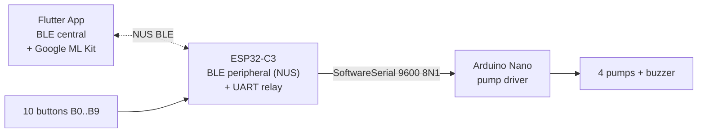

# Project Documentation — IoT Drink Mixer

A Rock-Paper-Scissors drinking game spanning three independent codebases (Flutter app, ESP32-C3 firmware, Arduino Nano firmware). This `docs/` tree is the single complete reference; each subfolder owns one codebase, and `cross-dependencies/` owns everything that crosses a wire between them.

## System at a glance



End-to-end flow: the app drives a best-of-three RPS series. The ESP samples the physical button matrix and reports each round's result over BLE. After the series, the app analyses the loser's selfie with ML Kit, picks a cocktail, and sends a pump recipe (`mix_a_b_c_d`) — the ESP relays it to the Nano, which drives the four pumps and confirms with `mix_ok`.

## Where to start

| If you need to… | Read |
|---|---|
| Understand the wire format end-to-end | [`cross-dependencies/protocol.md`](cross-dependencies/protocol.md) |
| See the wire frames between codebases | [`cross-dependencies/sequence-diagrams.md`](cross-dependencies/sequence-diagrams.md) |
| See step-by-step inside one codebase | per-codebase `sequence-diagrams.md` ([esp32-c3](esp32-c3/sequence-diagrams.md), [arduino-nano](arduino-nano/sequence-diagrams.md), [frontend](frontend/sequence-diagrams.md)) |
| Get the punch-list of broken things | [`cross-dependencies/known-issues.md`](cross-dependencies/known-issues.md) |
| Work on the BLE / button-matrix MCU | [`esp32-c3/README.md`](esp32-c3/README.md) |
| Work on the pump-driver MCU | [`arduino-nano/README.md`](arduino-nano/README.md) |
| Work on the Flutter app | [`frontend/README.md`](frontend/README.md) |

## Folder map

```
docs/
├── README.md                        ← you are here
├── esp32-c3/                        ← BLE peripheral + button matrix
│   ├── README.md                    ← overview + component diagram
│   ├── runtime.md                   ← setup/loop/helpers + state machine
│   ├── sequence-diagrams.md         ← boot, dispatch, round collection, mix relay (ESP-internal)
│   ├── protocol.md                  ← ESP's view of BLE in/out + UART out
│   └── known-issues.md              ← BLE stubs, listenBTNround bugs, dead code
├── arduino-nano/                    ← pump driver
│   ├── README.md
│   ├── runtime.md                   ← mix-parser walkthrough (textual)
│   ├── sequence-diagrams.md         ← boot, poll loop, mix happy path, parse failure
│   ├── protocol.md                  ← Nano's view of UART
│   └── known-issues.md
├── frontend/                        ← Flutter app
│   ├── README.md                    ← layered architecture
│   ├── services.md                  ← BleService, BleBackend, BleMixer, mocks
│   ├── features.md                  ← Home, Game (+ GamePhase state machine), Recipes
│   ├── sequence-diagrams.md         ← startup, scan/connect, test mode, game init, play round, ML pipeline, order drink
│   ├── ml-pipeline.md               ← ImageAnalyzer + cocktail scoring
│   └── known-issues.md
└── cross-dependencies/              ← the wire between them (interface-only)
    ├── README.md
    ├── protocol.md                  ← single source of truth for wire formats
    ├── sequence-diagrams.md         ← start handshake, one round, mix relay (wire frames only)
    └── known-issues.md              ← consolidated bug table (E-*, N-*, F-*)
```

## Source-of-truth precedence

When wire-format details appear in multiple places:

1. [`cross-dependencies/protocol.md`](cross-dependencies/protocol.md) — authoritative.
2. Per-codebase `protocol.md` — describes one side's view; defers to (1).
3. [`code/frontend/README.md`](../code/frontend/README.md) — user-facing summary; useful but not authoritative.
4. [`kommunikationsablauf.md`](../kommunikationsablauf.md) — original German one-pager; kept as historical record.

If any of (3) or (4) drift from (1), update (1) only if a new decision was made; otherwise update (3)/(4) to match.

## Pre-existing references kept alive

The Flutter project carries its own AI-agent guidance ([`code/frontend/copilot-instructions.md`](../code/frontend/copilot-instructions.md), [`.agents.md`](../code/frontend/.agents.md), [`.instructions.md`](../code/frontend/.instructions.md), [`.skills.md`](../code/frontend/.skills.md), the [`.github/`](../code/frontend/.github/) tree, and the static-analysis report [`analysis_result.md`](../code/frontend/analysis_result.md)). These remain authoritative for AI behaviour inside the Flutter codebase — the new docs reference them rather than duplicate.

## Change discipline

Anything that changes a wire message must touch *both* firmware ends, the Flutter service that emits/parses it, and [`cross-dependencies/protocol.md`](cross-dependencies/protocol.md). The change checklist lives at the bottom of that file.
