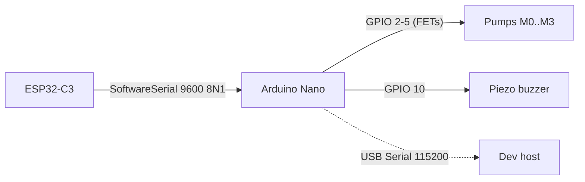

# Arduino Nano Firmware

Source: [`code/backend/code_arduino-nano/`](../../code/backend/code_arduino-nano/)
Entry point: [`src/main.cpp`](../../code/backend/code_arduino-nano/src/main.cpp)

## Role in the system

The Nano is the **pump driver**. It receives `mix_a_b_c_d` orders from the ESP32-C3 over a 9600-baud `SoftwareSerial` link and gates four pump motors via N-channel FETs, then answers with `mix_ok` and a two-beep buzzer pattern.



The Nano never speaks BLE and has no awareness of the game state — it sees only the final dispensing recipe.

## Build & flash

PlatformIO from `code/backend/code_arduino-nano/`:

```bash
pio run              # build
pio run -t upload    # flash
pio device monitor   # serial monitor at 115200 baud
```

Board: `nanoatmega328` · Platform: `atmelavr` · Framework: Arduino.

## Documentation in this folder

| File | Covers |
|---|---|
| [runtime.md](runtime.md) | `setup()` / `loop()` / `pump()`, the `mix_*` parser, and the buzzer pattern (textual walk-through). |
| [sequence-diagrams.md](sequence-diagrams.md) | Step-by-step sequence diagrams for every internal flow (boot, poll loop, mix happy path, mix parse failure). |
| [protocol.md](protocol.md) | Exactly which UART messages the Nano accepts and emits. |
| [known-issues.md](known-issues.md) | `B0`-pin collision with `SoftwareSerial` RX, dangling `Adafruit_VL53L0X` library dependency, manual-pumping TODO, blocking `delay()` pump driver. |
