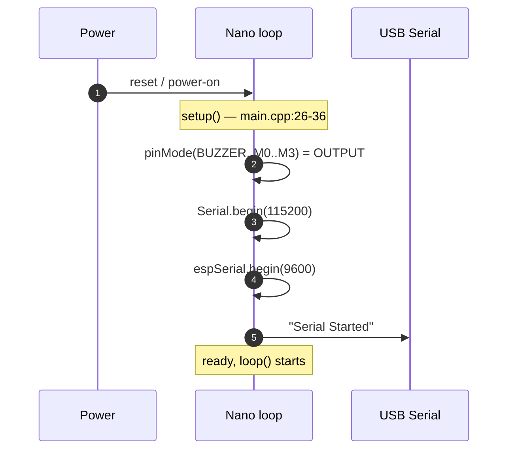
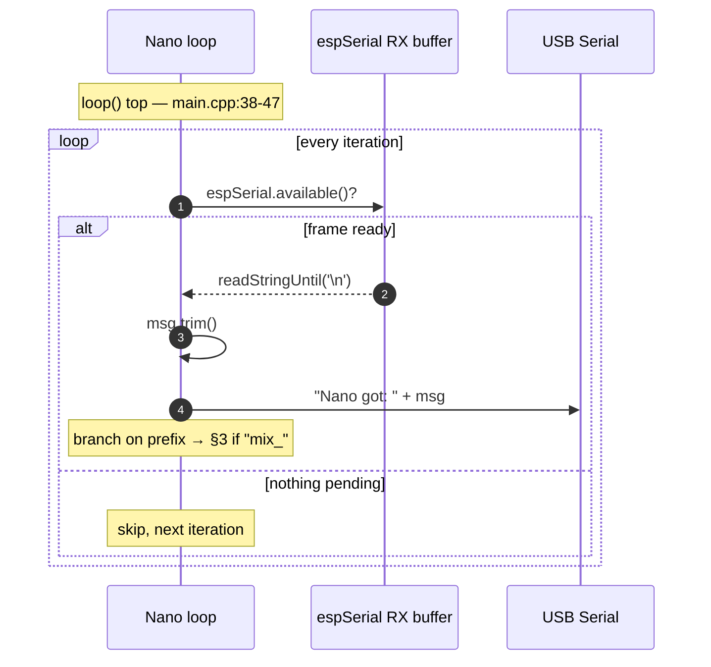
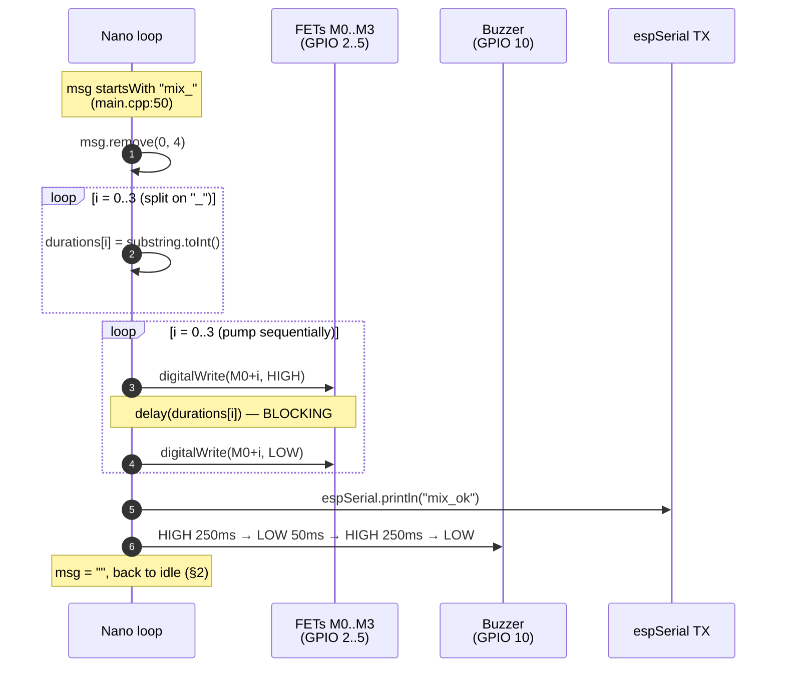
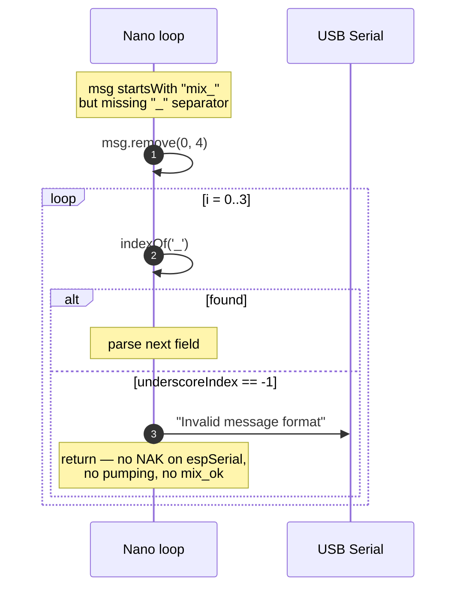

# Arduino Nano — Sequence Diagrams

Internal flows of the Nano firmware. Wire-level handshakes that cross UART belong in [`../cross-dependencies/sequence-diagrams.md`](../cross-dependencies/sequence-diagrams.md); this page only shows what happens **inside** the Nano between two UART events.

All line references are to [`code/backend/code_arduino-nano/src/main.cpp`](../../code/backend/code_arduino-nano/src/main.cpp).

## 1 — Boot & setup

Once `setup()` returns the Nano enters `loop()` and polls `espSerial` (§2).

## 2 — Idle poll loop

The Nano never sends anything to `espSerial` unsolicited — every outbound UART frame is the ack to a `mix_*` command. Anything that does not start with `mix_` is silently dropped after the USB echo.

## 3 — Mix command — happy path

Note that **`mix_ok` is emitted *before* the buzzer sequence** (lines 69 vs 72–78). The app's `BleMixerService.orderDrink` resolves while the buzzer is still beeping — the user sees "Drink ready" ~550 ms before the audible confirmation ends.

Total wall-clock time the Nano is unavailable for a typical recipe `mix_30_20_10_40`: ~100 ms pumping + ~550 ms buzzer ≈ 650 ms (see [`../cross-dependencies/protocol.md`](../cross-dependencies/protocol.md) for the full latency budget). The pumps run **blocking** via `delay()` ([known-issues.md §5](known-issues.md#5-pumps-run-blocking-in-sequence)).

## 4 — Mix command — parse failure

The Nano does **not** send a NAK back to the ESP on parse failure ([known-issues.md §4](known-issues.md#4-no-nak-on-malformed-mix_)). Combined with the ESP's missing `listenCMD` timeout ([../esp32-c3/known-issues.md §3](../esp32-c3/known-issues.md#3-listencmd-blocks-forever-lines-4951)), one malformed frame from the app can hang both firmwares until power-cycle; the Flutter `waitForMessage` 60-second BLE timeout is the only existing safety net ([../frontend/known-issues.md F-6](../frontend/known-issues.md#f-6-ble-disconnect-during-game-leaves-ui-stuck)).
