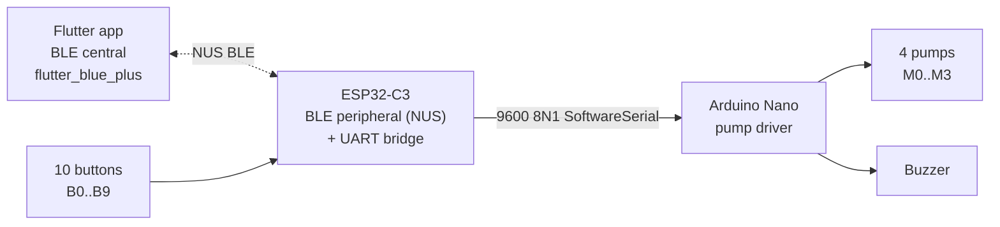

# Cross-Dependencies

The three codebases — Flutter app, ESP32-C3 firmware, Arduino Nano firmware — are independent projects that meet at two wires: a BLE link (Nordic UART Service) between phone and ESP, and a UART link (`SoftwareSerial`, 9600 8N1) between ESP and Nano. This folder is the **single source of truth** for everything that crosses those wires.

If a wire format or sequence here conflicts with what a per-codebase doc says, this folder wins.

## System overview

Three responsibilities, one game:

| Codebase | Owns | Does not touch |
|---|---|---|
| Flutter app | Game state, on-device recipe generation, ML selfie matching, cocktail → pump-amount mapping | Hardware buttons, pump GPIO |
| ESP32-C3 | BLE peripheral, button matrix, mix relay to Nano | Pumps, ML, recipes |
| Arduino Nano | Pump GPIOs, buzzer, `mix_ok`/`mix_err` ack | BLE, game logic, ML |

## Pages in this folder

| File | Covers |
|---|---|
| [protocol.md](protocol.md) | Every message that crosses BLE or UART, in both directions, with field semantics and units. Replaces the partial overlap between [`kommunikationsablauf.md`](../../kommunikationsablauf.md) and [`code/frontend/README.md`](../../code/frontend/README.md). |
| [sequence-diagrams.md](sequence-diagrams.md) | Mermaid sequences for the three normal-path interactions: start handshake, one round, mix relay. |
| [known-issues.md](known-issues.md) | Consolidated table of every defect documented per-codebase, with severity and cross-link. |

## Per-codebase entry points

| Codebase | Folder | Highlights |
|---|---|---|
| ESP32-C3 firmware | [`../esp32-c3/`](../esp32-c3/) | BLE-facing controller. **BLE stack currently stubbed.** |
| Arduino Nano firmware | [`../arduino-nano/`](../arduino-nano/) | Pump driver. Stateless command runner. |
| Flutter app | [`../frontend/`](../frontend/) | Game loop, ML inference, BLE central. |

## Change discipline

Every wire-format change touches **at least four files**:

1. The sending side (the codebase that emits the new message).
2. The receiving side (the codebase that parses it).
3. [`protocol.md`](protocol.md) in this folder.
4. [`code/frontend/README.md`](../../code/frontend/README.md) — the user-facing quick reference.

And possibly:

5. The Nordic UART skeleton in [`code/frontend/README.md`](../../code/frontend/README.md) lines 68–125, which the ESP32 firmware will eventually be ported against.

If any of those is omitted, treat the PR as incomplete. See [protocol.md](protocol.md) for the message inventory and [sequence-diagrams.md](sequence-diagrams.md) for the interaction patterns.
