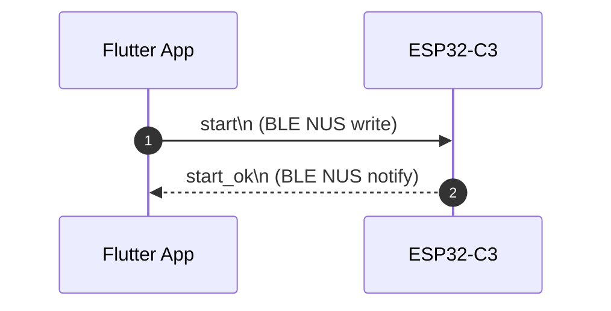
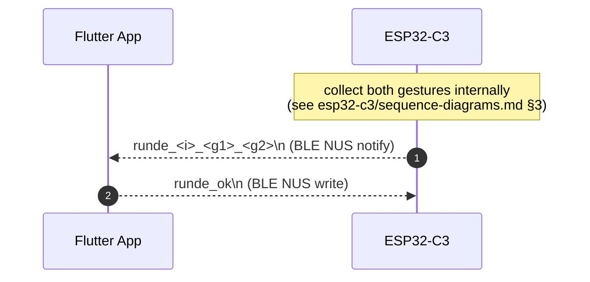
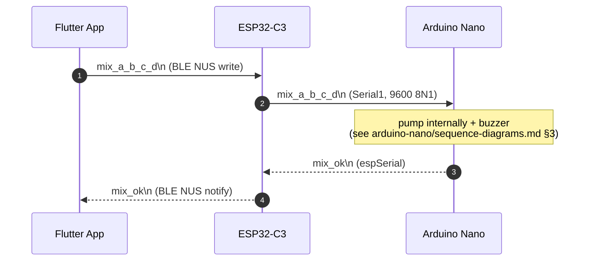

# Cross-Codebase Sequence Diagrams — Interface Only

This page shows **only what crosses a wire** between the three codebases. Internal hardware behaviour (button polling on the ESP, pump GPIO toggling on the Nano, app-internal service calls on Flutter) lives in the per-codebase sequence-diagrams files:

- ESP-internal flows → [`../esp32-c3/sequence-diagrams.md`](../esp32-c3/sequence-diagrams.md)
- Nano-internal flows → [`../arduino-nano/sequence-diagrams.md`](../arduino-nano/sequence-diagrams.md)
- App-internal flows → [`../frontend/sequence-diagrams.md`](../frontend/sequence-diagrams.md)

Three interactions cover every BLE / UART frame on the wire today. For field semantics see [protocol.md](protocol.md).

## 1 — Start handshake (BLE)

Triggered from [`GameScreen._init`](../../code/frontend/lib/features/game/game_screen.dart) — see [`../frontend/sequence-diagrams.md`](../frontend/sequence-diagrams.md) §5 for the app-internal `send` / `waitForMessage` orchestration. The ESP's dispatch of `start` is [`../esp32-c3/sequence-diagrams.md`](../esp32-c3/sequence-diagrams.md) §2.

Today the ESP's `sendBLE` / `listenBLE` are stubs ([`../esp32-c3/known-issues.md` §1](../esp32-c3/known-issues.md#1-ble-stack-is-not-implemented)), so this handshake hangs on the app's 60-second BLE timeout until the NUS stack is ported in.

## 2 — One round (BLE)

Repeated up to three times per series (the app stops after a 2-win majority or after 3 rounds — see [`../frontend/sequence-diagrams.md`](../frontend/sequence-diagrams.md) §6). On the wire `i ∈ {0,1,2}`; `g1`, `g2` ∈ {`0`=rock, `1`=paper, `2`=scissors}. The wire `i` is informational only — the app tracks the round count itself.

The button-polling that produces the `runde_*` value is documented at [`../esp32-c3/sequence-diagrams.md`](../esp32-c3/sequence-diagrams.md) §3 and is broken today ([`../esp32-c3/known-issues.md` §2](../esp32-c3/known-issues.md#2-listenbtnroundint-i--multiple-defects-lines-114174)).

## 3 — Mix relay (BLE + UART)

App side at [`BleMixerService.orderDrink`](../../code/frontend/lib/services/ble_mixer_service.dart) and [`../frontend/sequence-diagrams.md`](../frontend/sequence-diagrams.md) §8; ESP relay at [`../esp32-c3/sequence-diagrams.md`](../esp32-c3/sequence-diagrams.md) §4; Nano happy path at [`../arduino-nano/sequence-diagrams.md`](../arduino-nano/sequence-diagrams.md) §3 (and the parse-failure variant at §4).

The Nano emits `mix_ok` **before** the buzzer pattern, so the app reaches `GamePhase.drinkReady` while the buzzer is still beeping. Total app-perceived latency for a typical `mix_30_20_10_40` is ~165 ms (the 550 ms buzzer is *not* on the critical path) — see [protocol.md](protocol.md) for the breakdown.

## Test-mode equivalent (no hardware)

When `BleService.enableTestMode()` is active the app substitutes the BLE link with `inject(...)` / `sentMessages` ([`../frontend/sequence-diagrams.md`](../frontend/sequence-diagrams.md) §3). The same three wire interactions above still apply structurally, with the user (via the in-game debug panel) playing the role of the ESP — tapping injection buttons to feed `start_ok`, `runde_*`, and `mix_ok` in. The real ESP and Nano are bypassed entirely.
