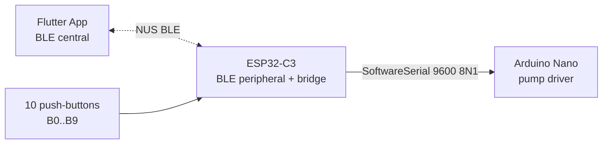

# ESP32-C3 Firmware

Source: [`code/backend/code_esp32-c3/`](../../code/backend/code_esp32-c3/)
Entry point: [`src/main.cpp`](../../code/backend/code_esp32-c3/src/main.cpp)

## Role in the system

The ESP32-C3 is the **BLE-facing controller** of the drink mixer. It sits between the Flutter app (BLE central) and the Arduino Nano (pump driver):



Responsibilities:
- Advertise a Nordic UART Service (NUS) BLE peripheral the app connects to.
- Read 10 push-buttons (`INPUT_PULLUP`) for the Rock-Paper-Scissors round logic. B0–B2 are Player 1, B3–B5 are Player 2; B6–B9 are wired but currently unused by the game loop.
- Relay `mix_*` orders from the app to the Nano over UART (`Serial1` on pins 21/20) and echo the Nano's `mix_ok` back to the app.

## Build & flash

PlatformIO from `code/backend/code_esp32-c3/`:

```bash
pio run              # build
pio run -t upload    # flash
pio device monitor   # serial monitor at 115200 baud
```

Board: `esp32-c3-devkitm-1` · Framework: Arduino · Default monitor/upload port: `/dev/ttyACM1`.

## Documentation in this folder

| File | Covers |
|---|---|
| [runtime.md](runtime.md) | `setup()` / `loop()` / every helper function, plus the per-loop state machine. |
| [sequence-diagrams.md](sequence-diagrams.md) | Step-by-step sequence diagrams for every internal flow (boot, dispatch, round collection, mix relay). |
| [protocol.md](protocol.md) | What this firmware expects on BLE and sends/receives over UART, from the ESP's point of view. The canonical multi-codebase protocol lives in [../cross-dependencies/protocol.md](../cross-dependencies/protocol.md). |
| [known-issues.md](known-issues.md) | Stubs (BLE), bugs (`listenBTNround`), dead code (`btnTest`), and missing-timeout hazards — what does not work end-to-end today. |
