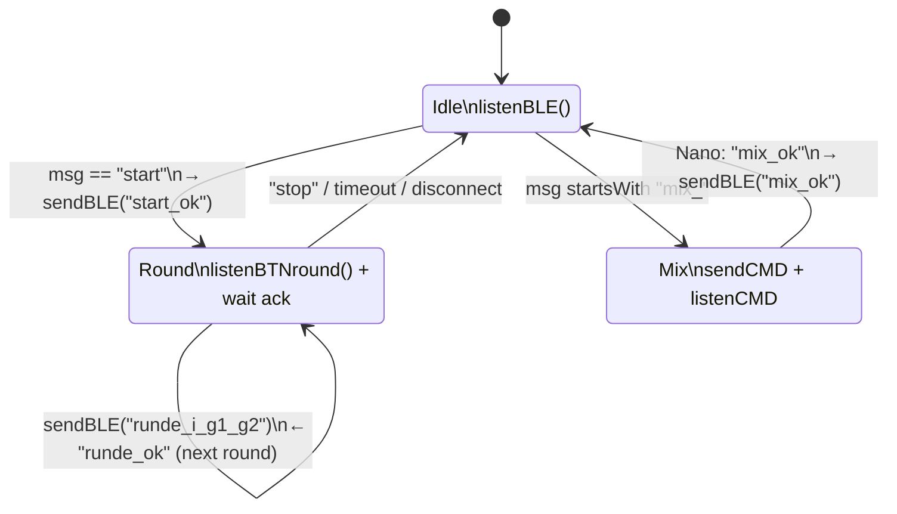

# ESP32-C3 — Runtime

All references are to [`code/backend/code_esp32-c3/src/main.cpp`](../../code/backend/code_esp32-c3/src/main.cpp).

## Build configuration

From [`platformio.ini`](../../code/backend/code_esp32-c3/platformio.ini):

| Key | Value |
|---|---|
| `platform` | `espressif32` |
| `board` | `esp32-c3-devkitm-1` |
| `framework` | `arduino` |
| `monitor_speed` | `115200` |
| `monitor_port` / `upload_port` | `/dev/ttyACM1` |
| `build_flags` | `-D ARDUINO_USB_MODE=1`, `-D ARDUINO_USB_CDC_ON_BOOT=1` |
| `lib_deps` | *(none declared)* |

The BLE stack required by [protocol.md](protocol.md) is **not yet pulled in** as a dependency, and the firmware does not currently compile as committed — see [known-issues.md](known-issues.md) §1 and §6.

## Pin map

| Symbol | GPIO | Mode | Role |
|---|---|---|---|
| `B0` | 4  | `INPUT_PULLUP` | Player 1 — Rock     (gesture `0`) |
| `B1` | 3  | `INPUT_PULLUP` | Player 1 — Paper    (gesture `1`) |
| `B2` | 2  | `INPUT_PULLUP` | Player 1 — Scissors (gesture `2`) |
| `B3` | 1  | `INPUT_PULLUP` | Player 2 — Rock     (gesture `0`) |
| `B4` | 0  | `INPUT_PULLUP` | Player 2 — Paper    (gesture `1`) |
| `B5` | 10 | `INPUT_PULLUP` | Player 2 — Scissors (gesture `2`) |
| `B6` | 9  | `INPUT_PULLUP` | *unused by game logic* |
| `B7` | 8  | `INPUT_PULLUP` | *unused by game logic* |
| `B8` | 7  | `INPUT_PULLUP` | *unused by game logic* |
| `B9` | 6  | `INPUT_PULLUP` | *unused by game logic* |
| `RXD1` | 21 | `Serial1` RX | UART from Nano |
| `TXD1` | 20 | `Serial1` TX | UART to Nano |

`Serial` (USB CDC) runs at 115200 baud for debug; `Serial1` runs at 9600 8N1 to match the Nano's `SoftwareSerial`.

## Function inventory

| Function | Lines | Purpose |
|---|---|---|
| `pressedStable(int pin)` | 31–37 | 10 ms double-read debounce. Returns `true` only if the pin is still `LOW` after the delay. |
| `sendCMD(String cmd)` | 41–45 | Writes `cmd + "\n"` to the Nano on `Serial1`, echoes on USB `Serial`. |
| `listenCMD()` | 49–51 | `Serial1.readStringUntil('\n')`. Blocking, but bounded by the 20 s `Serial1.setTimeout` set in `setup()`. |
| `sendBLE(String cmd)` | 55–57 | **Stub — empty body.** Intended to notify the NUS TX characteristic. |
| `listenBLE()` | 61–63 | **Stub — no body, no return.** Intended to pull from the NUS RX characteristic. |
| `setup()` | 66–83 | Sets all `B0`–`B9` as `INPUT_PULLUP`, opens `Serial` (115200), sets `Serial1.setTimeout(20000)`, opens `Serial1` (9600 8N1) on `RXD1`/`TXD1`. Calls `Serial1.begin` twice (redundant — [known-issues.md §7](known-issues.md)). |
| `loop()` | 86–122 | Reads a BLE message and dispatches: `"start"` → best-of-series game loop; `"mix_*"` → forward to Nano, await `mix_ok`. |
| `listenBTNround(int i)` | 127–187 | Reads buttons until each player has chosen a gesture, returns `"runde_<i>_<g1>_<g2>"`. **Multiple bugs — see [known-issues.md](known-issues.md) §2.** |
| `btnTest()` | 195–276 | **Dead code.** Never called. Contains a duplicated body and partial `lastBx` updates. |

Global debounce state lives at lines 17–26 (`lastB0` … `lastB9`, all initialized `HIGH`).

> ⚠️ `loop()` references `listenBLEBlocking(30000)` at line 100, but **no such function is defined** in the translation unit. The firmware therefore does not compile as committed — see [known-issues.md §6](known-issues.md).

## Per-loop state machine

Unlike the earlier fixed three-round `for` loop, `loop()` now runs an open-ended `while (playing)` series (lines 91–107):

1. `sendBLE(listenBTNround(round))` emits the round result.
2. An inner `while (true)` waits on `listenBLEBlocking(30000)` for the app's acknowledgement:
   - `"runde_ok"` → `round++`, collect the next round.
   - `"stop"` → the app has ended the series (2-win majority or 3 rounds reached); leave the loop.
   - empty string (timeout/disconnect) → leave the loop so the firmware does not hang.
   - anything else → ignored, keep waiting.

Because `listenBLE()` / `sendBLE()` are stubs and `listenBLEBlocking` is undefined, none of this runs on real hardware today.

## Mix relay

In the `mix_*` branch (lines 110–116) the ESP first drains any stale bytes from the `Serial1` RX buffer (`while (Serial1.available()) Serial1.read();`) so a leftover frame can't be mistaken for the ack, then `sendCMD(msg)` forwards the order verbatim and `listenCMD()` waits for the reply. Only an exact `"mix_ok"` is relayed to the app via `sendBLE("mix_ok")`. A `mix_err` NAK from the Nano (or a `listenCMD` timeout) is **not** relayed — see [known-issues.md §3](known-issues.md).

## Hardware-debug fast path

USB `Serial` (115200) mirrors every command sent to the Nano via `sendCMD` (`Serial.print("ESP sent: ")` at line 42) and surfaces any string read from BLE (when the stack is implemented). Watch it with `pio device monitor` to confirm the relay direction without the app.
