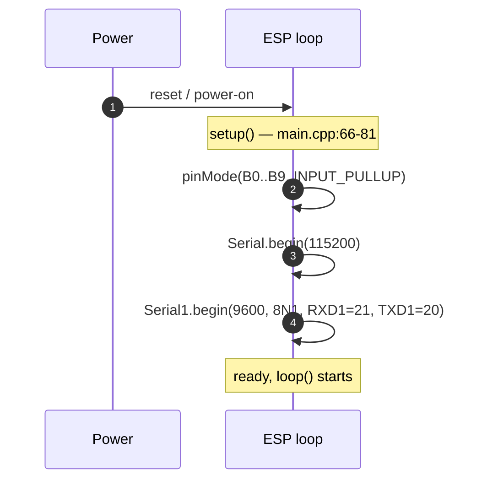
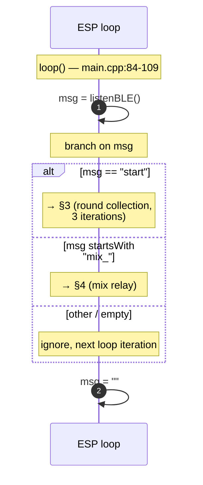
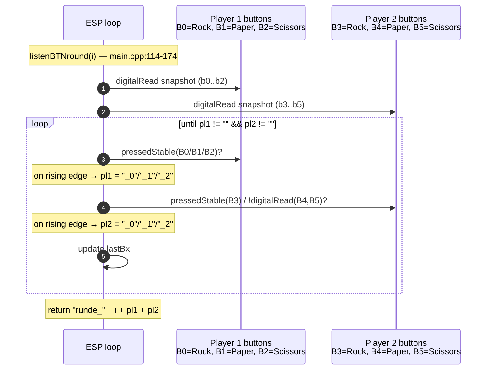
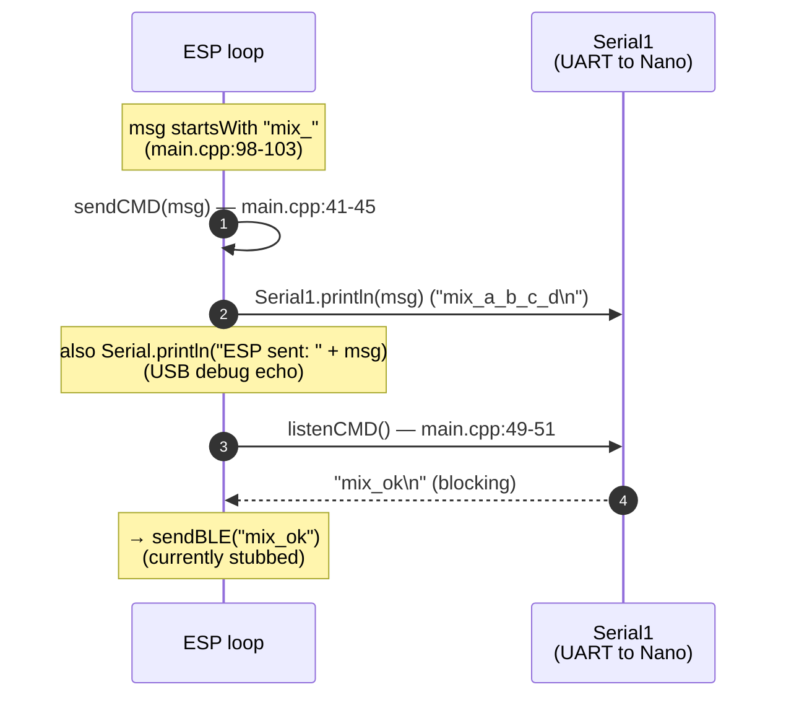

# ESP32-C3 — Sequence Diagrams

Internal flows of the ESP32-C3 firmware. Wire-level handshakes that cross BLE or UART belong in [`../cross-dependencies/sequence-diagrams.md`](../cross-dependencies/sequence-diagrams.md); this page only shows what happens **inside** the ESP between two wire events.

All line references are to [`code/backend/code_esp32-c3/src/main.cpp`](../../code/backend/code_esp32-c3/src/main.cpp). For the corresponding state machine (Idle / Round / Mix), see [runtime.md](runtime.md).

## 1 — Boot & setup

Once `setup()` returns the firmware enters `loop()` and starts dispatching messages (next diagram). The BLE stack is **not** initialised here today — see [known-issues.md §1](known-issues.md#1-ble-stack-is-not-implemented).

## 2 — Main-loop dispatch

`listenBLE()` is the entry point for every game message. It currently has no body ([known-issues.md §1](known-issues.md#1-ble-stack-is-not-implemented)) so neither branch can fire on real hardware yet. The actual handshakes (`start_ok`, `runde_x_y_z`, `mix_ok`) leave the ESP through `sendBLE()`, which is also stubbed.

## 3 — Round collection — `listenBTNround(i)`

This is the **intended** behaviour. Today the function has multiple bugs that prevent it from completing — see [known-issues.md §2](known-issues.md#2-listenbtnroundint-i--multiple-defects-lines-114174):

- B4 and B5 are read with `digitalRead(B3)` (typos).
- The outer loop guard is inverted (`while(pl1 != "" && pl2 != "")` instead of `while(pl1 == "" || pl2 == "")`).
- The inner assignment guards are also inverted.
- `lastBx` is updated from the entry-time snapshot, not the loop-time read.
- B4 / B5 use raw `!digitalRead()` instead of `pressedStable()`.

`listenBTNround` is called three times per series (see §2). Each call's return value is what the ESP then sends to the app as `runde_<i>_<g1>_<g2>` — that wire frame is documented in [`../cross-dependencies/sequence-diagrams.md`](../cross-dependencies/sequence-diagrams.md) §2.

## 4 — Mix relay — ESP side

`sendCMD` is opaque pass-through — the ESP never parses the body of `mix_*`. `listenCMD` has **no timeout** ([known-issues.md §3](known-issues.md#3-listencmd-blocks-forever-lines-4951)); if the Nano never answers, this branch hangs the loop. The Nano's side of the same exchange is in [`../arduino-nano/sequence-diagrams.md`](../arduino-nano/sequence-diagrams.md) §3.
