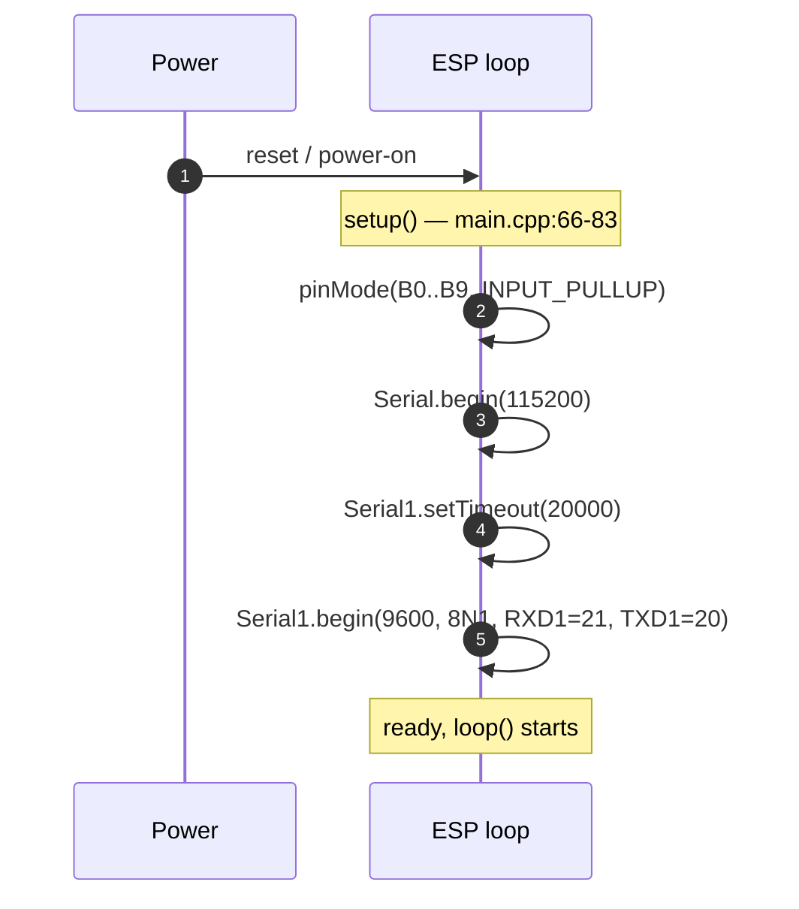
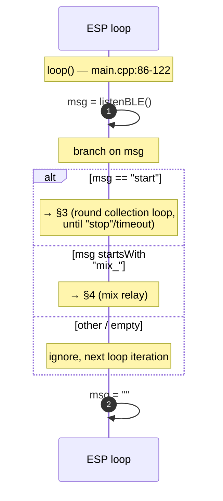
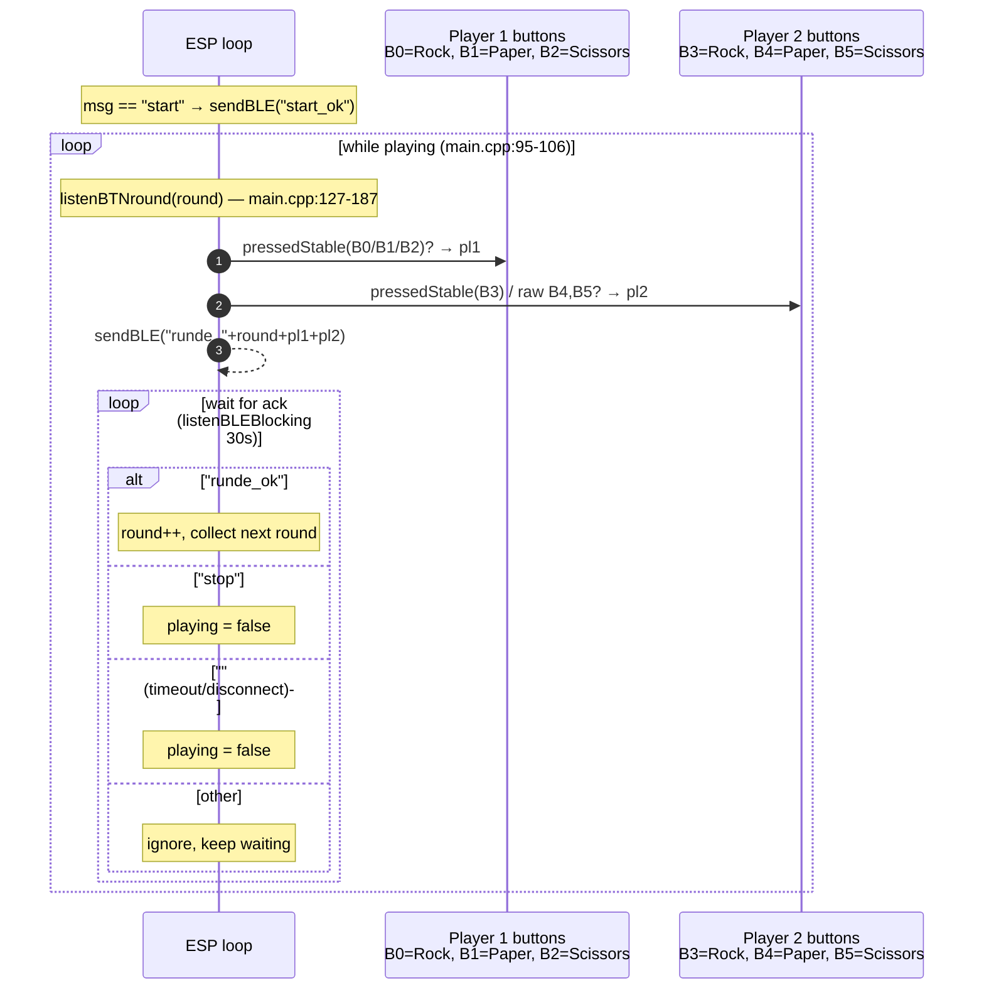
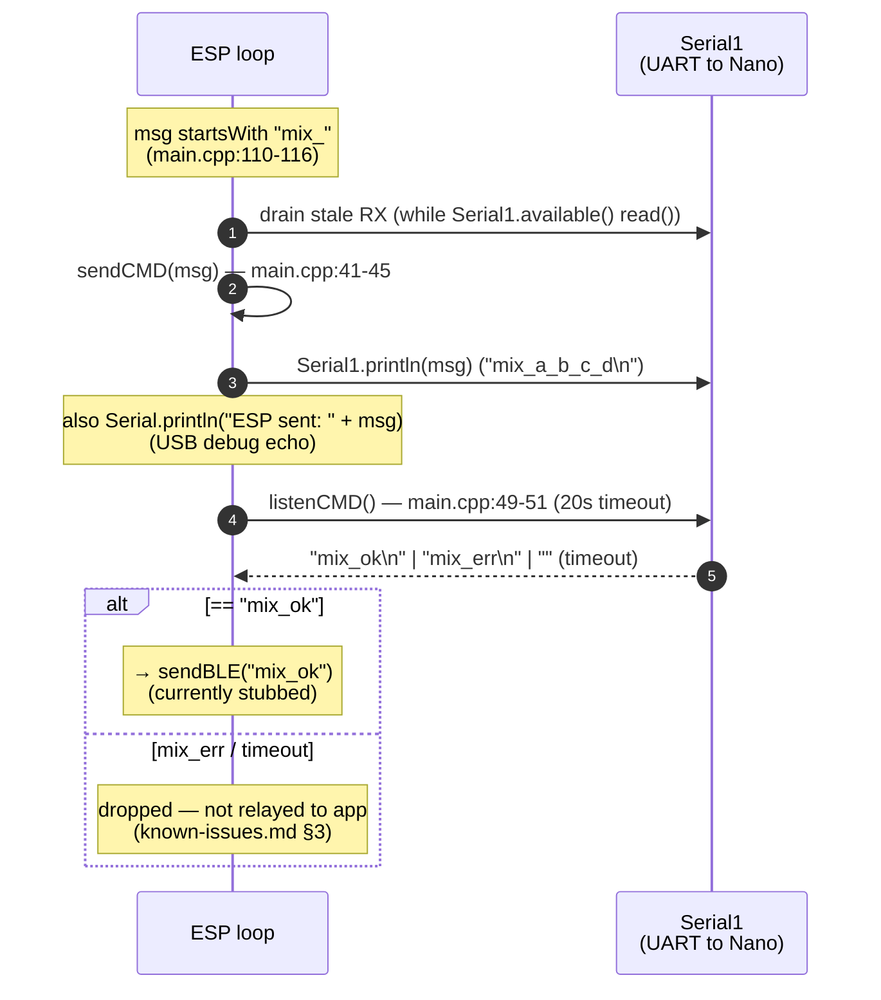

# ESP32-C3 — Sequence Diagrams

Internal flows of the ESP32-C3 firmware. Wire-level handshakes that cross BLE or UART belong in [`../cross-dependencies/sequence-diagrams.md`](../cross-dependencies/sequence-diagrams.md); this page only shows what happens **inside** the ESP between two wire events.

All line references are to [`code/backend/code_esp32-c3/src/main.cpp`](../../code/backend/code_esp32-c3/src/main.cpp). For the corresponding state machine (Idle / Round / Mix), see [runtime.md](runtime.md).

## 1 — Boot & setup

Once `setup()` returns the firmware enters `loop()` and starts dispatching messages (next diagram). The BLE stack is **not** initialised here today — see [known-issues.md §1](known-issues.md#1-ble-stack-is-not-implemented).

## 2 — Main-loop dispatch

`listenBLE()` is the entry point for every game message. It currently has no body ([known-issues.md §1](known-issues.md#1-ble-stack-is-not-implemented)) so neither branch can fire on real hardware yet.

## 3 — Round collection & series loop

The series is open-ended: the **app** decides when best-of-three is over and sends `stop` (the ESP no longer counts to three itself). This is the **intended** behaviour; today it is blocked by three defects:

- `listenBLEBlocking(30000)` (line 100) is **undefined** — the firmware does not compile ([known-issues.md §6](known-issues.md)).
- `listenBTNround` has multiple bugs (B4/B5 read as `B3`, inverted loop and assignment guards, stale `lastBx`, raw reads on B4/B5) — [known-issues.md §2](known-issues.md#2-listenbtnroundint-i--multiple-defects-lines-127187).
- `listenBLE` / `sendBLE` are stubs ([known-issues.md §1](known-issues.md)).

Each round's return value is what the ESP sends to the app as `runde_<i>_<g1>_<g2>` — that wire frame is documented in [`../cross-dependencies/sequence-diagrams.md`](../cross-dependencies/sequence-diagrams.md) §2.

## 4 — Mix relay — ESP side

`sendCMD` is opaque pass-through — the ESP never parses the body of `mix_*`. `listenCMD` now honours a 20 s timeout (`Serial1.setTimeout` in `setup()`), so a dead Nano no longer hangs the loop forever — but only an exact `"mix_ok"` is relayed to the app; a `mix_err` or a timeout is silently dropped ([known-issues.md §3](known-issues.md)). The Nano's side of the same exchange is in [`../arduino-nano/sequence-diagrams.md`](../arduino-nano/sequence-diagrams.md) §3.
