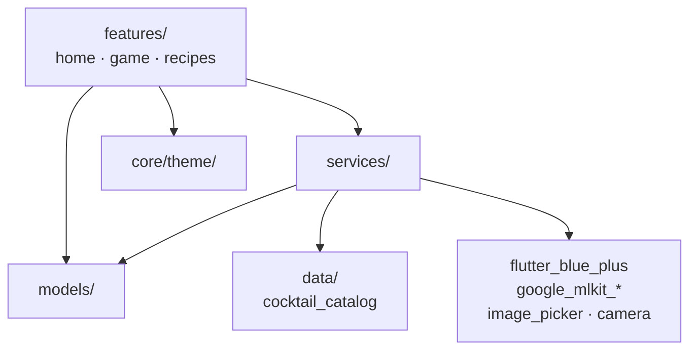

# Flutter Frontend (`iot_drink_mixer`)

Source: [`code/frontend/`](../../code/frontend/)
Entry point: [`lib/main.dart`](../../code/frontend/lib/main.dart) → `HomePage` ([`lib/features/home/home_page.dart`](../../code/frontend/lib/features/home/home_page.dart))
App title: **Gehirnzellen Massaker / Braincell Massacre**.

## Role in the system

The Flutter app is the **BLE central**. It talks to the ESP32-C3 over the Nordic UART Service, orchestrates the Rock-Paper-Scissors game state machine, runs Google ML Kit on the loser's selfie to pick a cocktail, and translates the cocktail to a `mix_a_b_c_d` order for the Nano-driven pumps.

Hardware-free development is a first-class concern: `BleService.enableTestMode()` makes every `send()` fan out to a `sentMessages` stream and exposes `inject(...)` to simulate incoming ESP messages. A debug panel inside the game screen surfaces both directions.

## Layered architecture



- `features/` is where every screen lives. Each feature is self-contained (`*_page.dart`, `widgets/`, `components/`, optional `extension/`).
- `services/` is the service-locator-free DI layer: each consumer either accepts an injected instance or falls back to a default (`BleBackendService([BleService? ble]) : _ble = ble ?? BleService.instance;`). See [services.md](services.md).
- `models/` are plain Dart classes — no framework dependencies. See [services.md](services.md) for the contract each uses.
- `core/theme/` (AppColors, AppTextStyles, AppRadius, AppTheme) is the single styling source. Hard-coded colors or radii in features should be treated as bugs.
- `data/cocktail_catalog.dart` is the in-app cocktail catalog used by the ML-based selector.

## Build & run

```bash
flutter pub get
flutter run                                 # launches on the connected device
dart format .
flutter analyze
flutter test                                # whole suite
flutter test test/path/to/file_test.dart    # single file
```

Dart SDK: `^3.7.2`. App version: `1.0.0+1`. Direct dependencies:

| Package | Purpose |
|---|---|
| `flutter_blue_plus` ^1.35.5 | BLE central, NUS write/notify. |
| `image_picker` ^1.1.2 | Selfie capture for both players (front camera, quality 85). |
| `camera` ^0.11.0 | Underlying camera primitives. |
| `google_mlkit_face_detection` ^0.13.0 | Smile, eye-open, head Euler angles. |
| `google_mlkit_image_labeling` ^0.14.0 | Top-N labels on the selfie. |
| `cupertino_icons` ^1.0.8 | iOS-style icons. |
| `flutter_lints` ^5.0.0 (dev) | Lint rules used by `flutter analyze`. |

No state-management package (`provider`, `riverpod`, `bloc`) is in use; screens manage their own state via `setState`.

## Documentation in this folder

| File | Covers |
|---|---|
| [services.md](services.md) | `BleService` + the backend / mixer / drink / cocktail / analyzer services, their interfaces and mocks. |
| [features.md](features.md) | `HomePage`, `PhotoCapturePage`, `GameScreen` (with the `GamePhase` state machine diagram), `RecipesPage`. |
| [sequence-diagrams.md](sequence-diagrams.md) | Step-by-step sequence diagrams for every app-internal flow (startup, scan/connect, test mode, photo capture, game init, play round, ML pipeline, order drink). |
| [ml-pipeline.md](ml-pipeline.md) | `ImageAnalyzerService` + the four `_score*` heuristics in `GoogleMLKitCocktailService`, with the cocktail-to-drink mapping. |
| [known-issues.md](known-issues.md) | Drift versus the protocol/architecture, dead code, missing tests, and unfinished features. |

## Existing AI guidance (do not duplicate)

The frontend already ships its own AI rules. The new docs reference them; they remain authoritative for behavior:

- [`copilot-instructions.md`](../../code/frontend/copilot-instructions.md) — overall guardrails for Copilot/Claude inside this Flutter project.
- [`.agents.md`](../../code/frontend/.agents.md), [`.instructions.md`](../../code/frontend/.instructions.md), [`.skills.md`](../../code/frontend/.skills.md) — agent/instruction/skill registry.
- [`.github/agents/`](../../code/frontend/.github/agents/), [`.github/instructions/`](../../code/frontend/.github/instructions/), [`.github/skills/`](../../code/frontend/.github/skills/) — definitions referenced by the registry files above.
- [`analysis_result.md`](../../code/frontend/analysis_result.md) — pre-existing static-analysis report; cited from [known-issues.md](known-issues.md).
- [`README.md`](../../code/frontend/README.md) — the original German/English Flutter README. Still accurate for the user-facing protocol summary.
