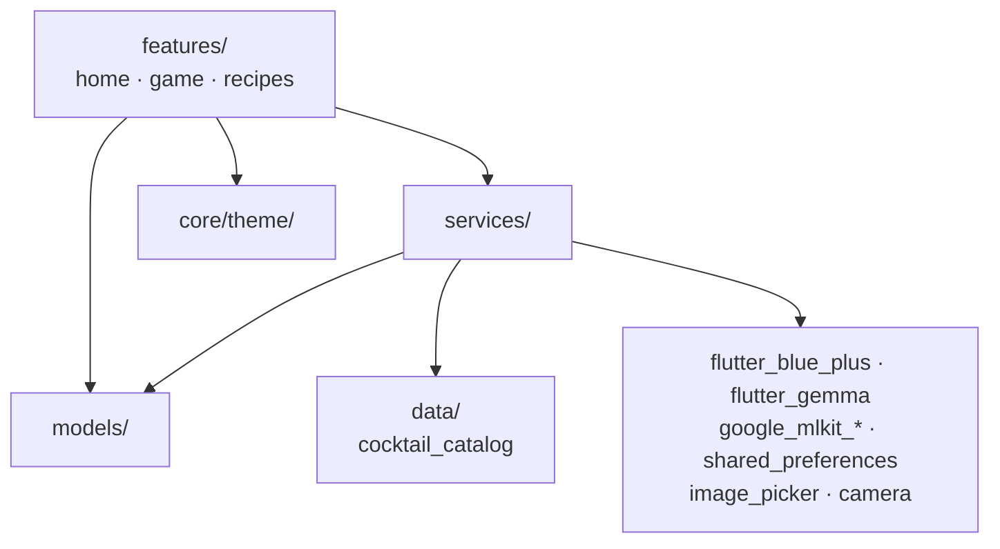

# Flutter Frontend (`iot_drink_mixer`)

Source: [`code/frontend/`](../../code/frontend/)
Entry point: [`lib/main.dart`](../../code/frontend/lib/main.dart) → `HomePage` ([`lib/features/home/home_page.dart`](../../code/frontend/lib/features/home/home_page.dart))
App title: **Gehirnzellen Massaker / Braincell Massacre**.

## Role in the system

The Flutter app is the **BLE central**. It:

- talks to the ESP32-C3 over the Nordic UART Service,
- orchestrates the Rock-Paper-Scissors game state machine,
- **generates a pool of cocktails** from the four drinks the user says are loaded in the pumps — on-device, via a small Gemma LLM (`flutter_gemma`), with a deterministic mock fallback,
- runs Google ML Kit on the loser's selfie to pick one cocktail from that pool,
- and translates the chosen cocktail to a `mix_a_b_c_d` order for the Nano-driven pumps.

Hardware-free development is a first-class concern: `BleService.enableTestMode()` makes every `send()` fan out to a `sentMessages` stream and exposes `inject(...)` to simulate incoming ESP messages. A debug panel inside the game screen surfaces both directions. Recipe generation likewise always works offline — the LLM is wired only in `main.dart`, so tests and test mode use the mock generator and never load a model.

## Layered architecture



- `features/` — every screen. Each feature is self-contained (`*_page.dart`, `widgets/`, `components/`, optional `extension/`).
- `services/` — the service-locator-free DI layer: each consumer accepts an injected instance or falls back to a default. Includes the BLE stack, the ML cocktail matcher, and the recipe-generation subsystem (`RecipeStore` + generators). See [services.md](services.md).
- `models/` — plain Dart classes, no framework dependencies (`Gesture`, `RoundResult`, `Drink`, `CocktailData`, `GeneratedCocktail`, `PumpSetup`, plus the `kMoodTags` vocabulary).
- `core/theme/` — the single styling source. Hard-coded colors/radii in features are bugs.
- `data/cocktail_catalog.dart` — a fixed four-cocktail catalog used only as the fallback when no pool has been generated yet.

## Build & run

```bash
flutter pub get
flutter run                                 # launches on the connected device
dart format .
flutter analyze
flutter test                                # whole suite
flutter test test/path/to/file_test.dart    # single file
```

Dart SDK: `^3.7.2`. App version: `1.0.0+1`. Direct dependencies:

| Package | Version | Purpose |
|---|---|---|
| `flutter_blue_plus` | ^2.3.8 | BLE central, NUS write/notify. |
| `flutter_gemma` | ^0.16.5 | On-device LLM for recipe generation (offline, no API key). Pinned to 0.16.x for Flutter 3.41 / Dart 3.11. |
| `shared_preferences` | ^2.3.2 | Persists the pump setup + generated pool across restarts. |
| `image_picker` | ^1.1.2 | Selfie capture for both players (front camera, quality 85). |
| `camera` | ^0.12.0+1 | Underlying camera primitives. |
| `google_mlkit_face_detection` | ^0.13.0 | Smile, eye-open, head Euler angles. |
| `google_mlkit_image_labeling` | ^0.14.0 | Top-N labels on the selfie. |
| `cupertino_icons` | ^1.0.8 | iOS-style icons. |
| `flutter_lints` | ^6.0.0 (dev) | Lint rules used by `flutter analyze`. |

The on-device model is loaded from `assets/models/gemma.task` (see [`assets/models/README.md`](../../code/frontend/assets/models/README.md)); the folder is registered in `pubspec.yaml` so the build works even before the model is dropped in — a missing model just falls back to the mock generator.

No state-management package (`provider`, `riverpod`, `bloc`) is in use; screens manage their own state via `setState`, and `RecipeStore` is a `ChangeNotifier` consumed via `AnimatedBuilder`.

## Documentation in this folder

| File | Covers |
|---|---|
| [services.md](services.md) | BLE stack, drink/cocktail/mixer abstractions, the recipe-generation subsystem (`RecipeStore`, `RecipeGeneratorService`, Gemma), and the cocktail catalog. |
| [features.md](features.md) | `HomePage` (+ MIX RANDOM DRINK), `PhotoCapturePage`, `GameScreen` (with the `GamePhase` state machine and abort handling), `RecipesPage` (What's in the box + generated pool). |
| [sequence-diagrams.md](sequence-diagrams.md) | App-internal flows: startup + model wiring, scan/connect, test mode, photo capture, game init, play round, recipe generation, select drink, order drink. |
| [ml-pipeline.md](ml-pipeline.md) | `ImageAnalyzerService` + the generic mood-weight scorer in `GoogleMLKitCocktailService`, and how a cocktail becomes pump amounts. |
| [known-issues.md](known-issues.md) | Remaining drift/dead code + a log of what's been resolved. |

## Existing AI guidance (do not duplicate)

The frontend ships its own AI rules; the new docs reference them:

- [`copilot-instructions.md`](../../code/frontend/copilot-instructions.md) — overall guardrails for Copilot/Claude inside this Flutter project.
- [`.agents.md`](../../code/frontend/.agents.md), [`.instructions.md`](../../code/frontend/.instructions.md), [`.skills.md`](../../code/frontend/.skills.md) — agent/instruction/skill registry.
- [`.github/agents/`](../../code/frontend/.github/agents/), [`.github/instructions/`](../../code/frontend/.github/instructions/), [`.github/skills/`](../../code/frontend/.github/skills/) — definitions referenced by the registry files above.
- [`analysis_result.md`](../../code/frontend/analysis_result.md) — pre-existing static-analysis report; cited from [known-issues.md](known-issues.md).
- [`README.md`](../../code/frontend/README.md) — the original German/English Flutter README, incl. the ESP-side NUS skeleton the firmware will be ported against.
