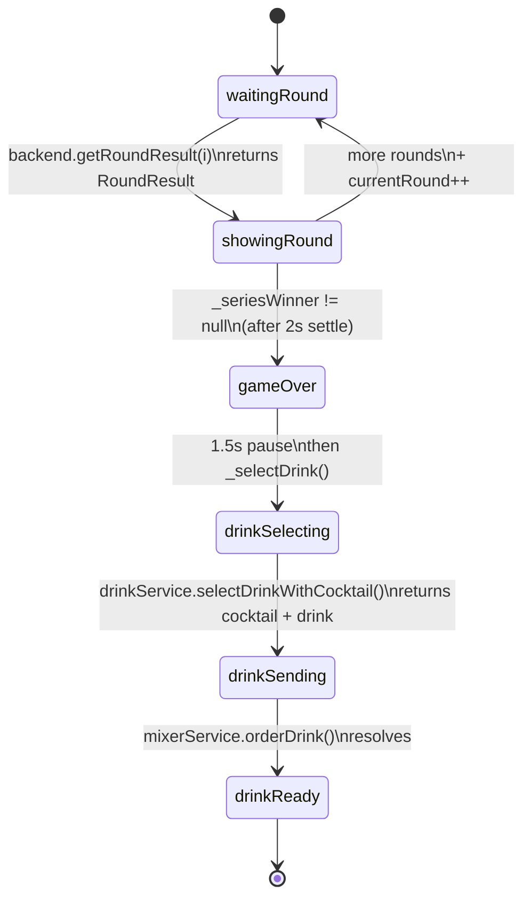

# Frontend — Features

Three top-level screens, plus the photo-capture intermediary. All paths relative to [`code/frontend/lib/`](../../code/frontend/lib/).

```
features/
├── home/        → HomePage           (entry, BLE status, test-mode switch)
├── game/        → PhotoCapturePage → GameScreen
└── recipes/     → RecipesPage        (catalog browsing, not wired to mixer)
```

## Home — `features/home/home_page.dart`

State the screen owns:

| State | Source |
|---|---|
| `_navIndex` | Bottom-nav tab (0 = home, 1 = recipes). |
| `_bleConnected`, `_bleDeviceName` | Mirrors `BleService.instance.connectionStream` (subscribed in `initState`, cancelled in `dispose`). |

Visible elements: gradient header (`Gehirnzellen Massaker` in `headingUltraLarge`), `HomeStatusRow` showing connection state, `NextActionCard` explaining the flow, a "Test Modus (ohne ESP32)" button while disconnected, and `StartGameButton` which pushes `PhotoCapturePage`.

**BLE scan flow** — tapping the status row opens `_BleScanSheet`. Bottom-sheet drives `BleService.instance.startScan()` and renders devices from `scanResults`. Tapping a device calls `BleService.instance.connect(device)`; failures bubble up to a `SnackBar`. If already connected the sheet collapses to a "Trennen" button.

**Test-mode entry** — pressing "Test Modus (ohne ESP32)" calls `BleService.instance.enableTestMode()`. From that point, the same `StartGameButton` works without hardware; outgoing messages appear in the in-game debug panel.

Supporting widgets under `features/home/components/`:

| Widget | Role |
|---|---|
| `top_header.dart` | App title block. |
| `status_card.dart` + `home_status_row.dart` | Renders connection state badge. |
| `next_action_card.dart` | Gradient CTA with current next-step hint. |
| `start_game_button.dart` | Large primary button. |
| `bottom_nav_item.dart` | Stateful tab indicator. |

## Photo capture — `features/game/photo_capture_page.dart`

Captures one selfie per player via `ImagePicker().pickImage(source: camera, preferredCameraDevice: front, imageQuality: 85)`. State holds `_p1Path`, `_p2Path`, `_isCapturing`. The start button is disabled until both paths are set.

On start, `_startGame()` builds the service graph (`BleBackendService()`, `BleMixerService()`, `MockDrinkService()` — note `MockDrinkService` is the real ML-backed implementation; see [services.md](services.md)) and navigates to `GameScreen(...)` with both image paths via `Navigator.pushReplacement` (so the photo-capture page is removed from the back stack — after the game the user lands back on the home screen, not on photo capture).

Components under `features/game/components/`:

| Widget | Role |
|---|---|
| `photo_capture_header.dart` | Back button + title. |
| `photo_capture_step_indicator.dart` | Visual progress for "P1 done? / P2 done?". |
| `player_photo_card.dart` | Tappable preview tile per player. |
| `photo_capture_start_button.dart` | "START GAME"; gated on both photos. |

## Game — `features/game/game_screen.dart`

`GameScreen` accepts five required constructor params (`player1ImagePath`, `player2ImagePath`, `BleBackendService backend`, `DrinkService drinkService`, `MixerService mixerService`) so tests can inject mocks. State of interest:

| State | Type | Notes |
|---|---|---|
| `_rounds` | `List<RoundResult>` | Appended each round. |
| `_phase` | `GamePhase` | Drives the UI; see state machine below. |
| `_currentRound` | `int` | 1-indexed, used as the `round` arg to `getRoundResult`. |
| `_drink`, `_selectedCocktail`, `_loserPlayer` | nullable | Populated during `_selectDrink`. |
| `_p1Wins`, `_p2Wins`, `_seriesWinner` | getters | Best-of-three: first to 2 wins, or majority after 3 rounds (draws inside the series stay as `null`). |

### `GamePhase` state machine

Defined in [`features/game/extension/game_phase.dart`](../../code/frontend/lib/features/game/extension/game_phase.dart). The extension `GamePhaseExt.isPostGame` returns `index >= gameOver.index` — used to gate UI changes after the series ends.



### Flow narrative

1. `initState` → `_init()`: if `BleService.instance.isConnected`, send `"start"` and `await waitForMessage('start_ok')`. Then `_playRound()`.
2. `_playRound()` sets `waitingRound`, calls `backend.getRoundResult(_currentRound)` (this is the blocking BLE round), appends to `_rounds`, flips to `showingRound`, holds 2 s, then either recurses (`_currentRound++`) or transitions to `gameOver`.
3. `gameOver` holds 1.5 s, then `_selectDrink()` runs (`drinkSelecting → drinkSending → drinkReady`).
4. `drinkReady` shows `CocktailRecommendation` + a "ZURÜCK ZUM START" button.

### Widgets

Under `features/game/widgets/`:

| Widget | Role |
|---|---|
| `game_result_header.dart` | Title + spinner/dot depending on phase. |
| `player_cards_row.dart` + `player_card.dart` | Two player photo cards. Highlights the winner and shows the last round's gesture. |
| `series_stats_card.dart` | Score tally for the series. |
| `drink_section.dart` | Animated container that swaps copy by phase (`gameOver` → "Drink wird ermittelt…", `drinkSelecting` → "KI analysiert Loser-Foto…", `drinkSending` → "Drink wird gemixt…", `drinkReady` → `CocktailRecommendation` + back-to-start button). |
| `cocktail_recommendation.dart` | Recommendation card. |
| `ble_debug_panel.dart` | Draggable bottom sheet exposed via the bug-icon FAB when connected. Lists sent (blue) and received (green) lines; provides one-tap inject buttons for `start_ok`, sample `runde_*`, and `mix_ok` — the test-mode replacement for the ESP32. Subscriptions are cancelled in `dispose`. |

## Recipes — `features/recipes/recipes_page.dart`

Pure UI demo, **not wired to the mixer**. Holds a `TextEditingController` and a `RecipeFilter` (`all`, `available`, `favorites`). Filters [`recipe_catalog.dart`](../../code/frontend/lib/features/recipes/data/recipe_catalog.dart) (four hard-coded `RecipeItem`s with Unsplash URLs) and renders the first as a `FeaturedRecipeCard`, the rest as `RecipeTile`s.

The page also declares **dead** local enums (`_RecipeFilter`, `_RecipeStatus`, `_RecipeItem`) duplicating [`recipe_models.dart`](../../code/frontend/lib/features/recipes/models/recipe_models.dart) — flagged in [known-issues.md](known-issues.md).

Widgets under `features/recipes/widgets/`: `featured_recipe_card`, `recipe_tile`, `recipe_image`, `recipe_search_field`, `recipe_filter_bar`, `status_badge`.

## End-to-end test-mode walkthrough

1. Home → "Test Modus (ohne ESP32)" → `BleService.enableTestMode()`.
2. "START GAME" → take two selfies (`ImagePicker`) → `GameScreen`.
3. `_init` sends `start`. In test mode, `send` pushes to `sentMessages`. The user opens the debug panel and taps `start_ok` (which calls `BleService.instance.inject('start_ok')`). `waitForMessage('start_ok')` resolves.
4. For each round, the panel injects e.g. `runde_1_0_2`. `BleBackendService.getRoundResult` resolves, `_playRound` advances.
5. After series ends, `MockDrinkService` runs the real ML pipeline on the loser's selfie, producing a `CocktailData` + `Drink`.
6. `BleMixerService.orderDrink` calls `_ble.send('mix_…')` (visible in panel) and waits. The user injects `mix_ok`.
7. UI lands on `drinkReady`.

This loop is exactly what the real ESP32 firmware will drive once its BLE stack is implemented (see [`../esp32-c3/known-issues.md`](../esp32-c3/known-issues.md)).
