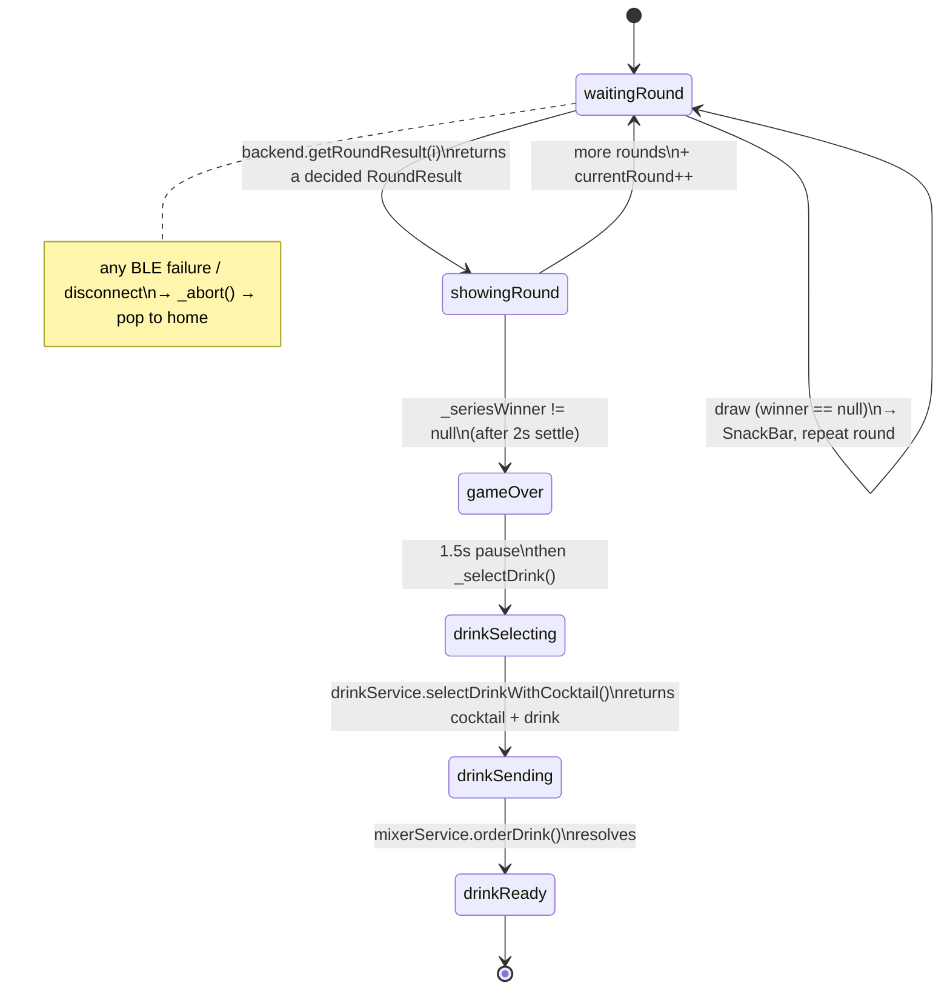

# Frontend — Features

Three top-level screens, plus the photo-capture intermediary. All paths relative to [`code/frontend/lib/`](../../code/frontend/lib/).

```
features/
├── home/        → HomePage           (entry, BLE status, test-mode switch, MIX RANDOM DRINK)
├── game/        → PhotoCapturePage → GameScreen
└── recipes/     → RecipesPage        (What's in the box → generated cocktail pool)
```

Bottom nav has two tabs: **HOME** and **RECIPE** (`_navIndex` 0/1).

## Home — `features/home/home_page.dart`

State the screen owns:

| State | Source |
|---|---|
| `_navIndex` | Bottom-nav tab (0 = home, 1 = recipes). |
| `_bleConnected`, `_bleDeviceName` | Mirrors `BleService.instance.connectionStream` (subscribed in `initState`, cancelled in `dispose`). |

Home tab elements: title (`Gehirnzellen Massaker`, `headingUltraLarge`), `HomeStatusRow` (connection state, taps open the scan sheet), `NextActionCard`, a "Test Modus (ohne ESP32)" button while disconnected, `StartGameButton` (pushes `PhotoCapturePage`), and `MixRandomDrinkButton`.

**BLE scan flow** — tapping the status row opens `_BleScanSheet` (defined in the same file). It drives `BleService.instance.startScan()` and lists devices from `scanResults`; tapping one calls `connect(device)` and pops on success, or shows a `SnackBar` on failure. When already connected the sheet shows a "Trennen" (disconnect) tile.

**Test-mode entry** — "Test Modus (ohne ESP32)" calls `enableTestMode()`. From then on the same buttons work without hardware; outgoing messages appear in the in-game debug panel.

**MIX RANDOM DRINK** — [`components/mix_random_drink_button.dart`](../../code/frontend/lib/features/home/components/mix_random_drink_button.dart) pours a random cocktail from `RecipeStore.instance.pool` without playing a game. Guards: it needs a connection *or* test mode, and a non-empty pool (otherwise a SnackBar nudges the user to connect or generate first). On real hardware it uses `BleMixerService` (waits for `mix_ok`); **in test mode it uses `MockMixerService`** so the home screen — which has no debug panel to inject `mix_ok` — doesn't hang.

Supporting widgets under `features/home/components/`: `top_header.dart`, `status_card.dart` + `home_status_row.dart`, `next_action_card.dart`, `start_game_button.dart`, `mix_random_drink_button.dart`, `bottom_nav_item.dart`.

## Photo capture — `features/game/photo_capture_page.dart`

Captures one selfie per player via `ImagePicker().pickImage(source: camera, preferredCameraDevice: front, imageQuality: 85)`. State holds `_p1Path`, `_p2Path`, `_isCapturing`. The start button is gated until both paths are set.

On start, `_startGame()` builds the service graph (`BleBackendService()`, `BleMixerService()`, `MockDrinkService()` — the latter is the real ML-backed implementation despite the name; see [services.md](services.md)) and navigates to `GameScreen(...)` via `Navigator.pushReplacement` (so photo capture is dropped from the back stack; after the game the user lands on home).

Components under `features/game/components/`: `photo_capture_header.dart`, `photo_capture_step_indicator.dart`, `player_photo_card.dart`, `photo_capture_start_button.dart`.

## Game — `features/game/game_screen.dart`

`GameScreen` takes five required params (`player1ImagePath`, `player2ImagePath`, `BleBackendService backend`, `DrinkService drinkService`, `MixerService mixerService`) so tests can inject mocks. State of interest:

| State | Type | Notes |
|---|---|---|
| `_rounds` | `List<RoundResult>` | Appended per decided round (draws are not appended). |
| `_lastResult` | `RoundResult?` | The most recent round, incl. draws, for the UI. |
| `_phase` | `GamePhase` | Drives the UI; see state machine below. |
| `_currentRound` | `int` | 1-indexed, used as the `round` arg to `getRoundResult`. |
| `_drink`, `_selectedCocktail`, `_loserPlayer` | nullable | Populated during `_selectDrink`. |
| `_connSub`, `_aborted` | | Mid-game disconnect handling. |
| `_p1Wins`, `_p2Wins`, `_seriesWinner` | getters | Best-of-three: first to 2 wins, or majority after 3 rounds (`_seriesLength = 3`; draws stay `null`). |

### Abort / disconnect handling (ex-F-6)

`initState` refuses to start if not connected: it schedules `_abort('Kein Gerät verbunden…')`. Otherwise it subscribes to `connectionStream` and, if the link drops before the game is over (`!_phase.isPostGame`), calls `_abort('Verbindung zum ESP32 verloren.')`. `_abort` shows a SnackBar and `Navigator.popUntil((r) => r.isFirst)`. Every BLE wait (`_init`, `getRoundResult`, `orderDrink`) is wrapped in `try/catch` that also aborts with "Keine Antwort vom ESP32 erhalten." — so a timeout no longer leaves the UI stuck.

### `GamePhase` state machine

Defined in [`extension/game_phase.dart`](../../code/frontend/lib/features/game/extension/game_phase.dart). `GamePhaseExt.isPostGame` returns `index >= gameOver.index` — gates post-series UI.



### Flow narrative

1. `initState` → `_init()`: send `"start"`, `await waitForMessage('start_ok')` (abort on failure), then `_playRound()`.
2. `_playRound()` sets `waitingRound`, calls `backend.getRoundResult(_currentRound)`. **Draws** (`winner == null`) show a SnackBar ("Unentschieden! Runde wird wiederholt.") and re-run the round without advancing. Decided rounds append to `_rounds`, flip to `showingRound`, hold 2 s, then either recurse (`_currentRound++`) or go to `gameOver`.
3. `gameOver` holds 1.5 s, then `_selectDrink()` runs (`drinkSelecting → drinkSending → drinkReady`).
4. `drinkReady` shows the `CocktailRecommendation` + a back-to-start button.

> The draw-repeat logic appears twice in `_playRound` — the second block is unreachable dead code (`_playRound` already returned). Cosmetic; tracked as [known-issues.md F-11](known-issues.md). The `(widget.drinkService as dynamic)` cast in `_selectDrink` also persists ([F-3](known-issues.md)).

### Widgets

Under `features/game/widgets/`:

| Widget | Role |
|---|---|
| `game_result_header.dart` | Title + spinner/indicator by phase. |
| `player_cards_row.dart` + `player_card.dart` | Two player photo cards; highlights the winner and the last round's gesture. |
| `series_stats_card.dart` | Score tally for the series. |
| `drink_section.dart` | Swaps copy by phase (`gameOver` → "Drink wird ermittelt…", `drinkSelecting` → "KI analysiert…", `drinkSending` → "wird gemixt…", `drinkReady` → `CocktailRecommendation` + back button). |
| `cocktail_recommendation.dart` | Recommendation card. |
| `ble_debug_panel.dart` | Draggable sheet via the bug-icon FAB (only when connected). Lists sent (blue) / received (green) lines; one-tap inject buttons for `start_ok`, sample `runde_*`, `mix_ok` — the test-mode stand-in for the ESP. Subscriptions cancelled in `dispose`. |

## Recipes — `features/recipes/recipes_page.dart`

Completely rebuilt around the recipe generator (the earlier browse-only catalog and its dead local types are gone — ex-F-4). A stateless `RecipesPage` rebuilt via `AnimatedBuilder(animation: RecipeStore.instance)`:

- **"What's in the box"** button opens [`widgets/whats_in_the_box_overlay.dart`](../../code/frontend/lib/features/recipes/widgets/whats_in_the_box_overlay.dart) to edit the four pump ingredients; on save it calls `store.updateSetupAndRegenerate(...)`, which regenerates the pool only if the ingredients changed.
- When `store.setup.isComplete`, a `_PumpSummary` chip row shows the four ingredients.
- Body states: `_GeneratingView` (spinner; while a model-backed generator downloads/loads, it surfaces `GemmaModelStatus` progress), `_EmptyState` (no pool yet), or a `ListView` of [`GeneratedCocktailTile`](../../code/frontend/lib/features/recipes/widgets/generated_cocktail_tile.dart)s followed by a "Neu generieren" (`store.regenerate`) button.

The generated pool is what the game's `MockDrinkService` selects the loser's drink from and what MIX RANDOM DRINK pours — so the recipe feature now drives the mixer (ex-F-5), even though the Recipe tab itself has no direct "pour this one" action.

Widgets under `features/recipes/widgets/`: `generated_cocktail_tile.dart`, `whats_in_the_box_overlay.dart`.

## End-to-end test-mode walkthrough

1. **(Optional, once)** RECIPE tab → "What's in the box" → enter four drinks → cocktails generate (mock generator in test mode).
2. Home → "Test Modus (ohne ESP32)" → `enableTestMode()`.
3. "START GAME" → two selfies (`ImagePicker`) → `GameScreen`.
4. `_init` sends `start`; open the debug panel and inject `start_ok` → `waitForMessage('start_ok')` resolves.
5. Per round, inject e.g. `runde_1_0_2`. `getRoundResult` resolves, `_playRound` advances (injecting a draw like `runde_1_1_1` repeats the round).
6. After the series, `MockDrinkService` matches the loser's selfie against the generated pool (or the fallback catalog) → `CocktailData` + `Drink`.
7. `BleMixerService.orderDrink` sends `mix_…` (visible in the panel); inject `mix_ok`.
8. UI lands on `drinkReady`.

This loop is what the real ESP32 firmware will drive once its BLE stack is implemented (see [`../esp32-c3/known-issues.md`](../esp32-c3/known-issues.md)).
