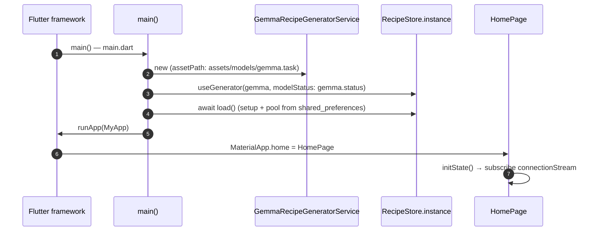
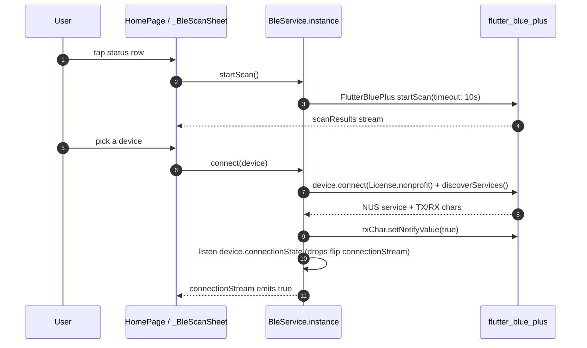
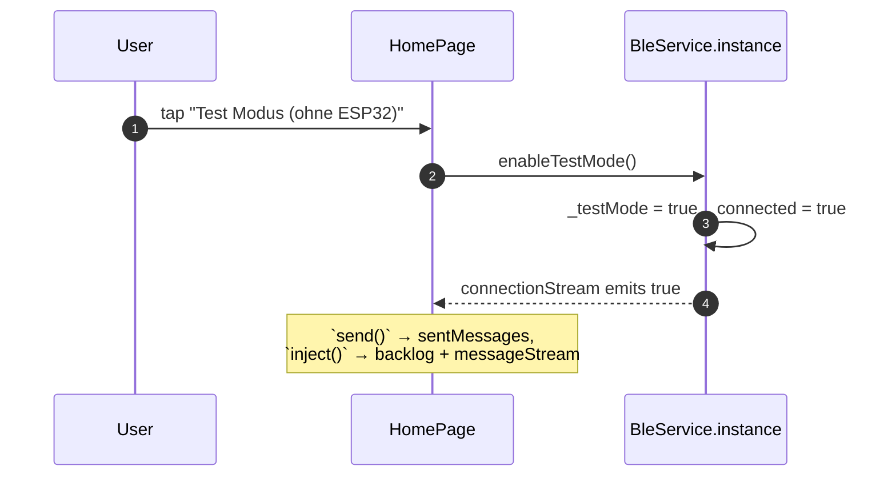
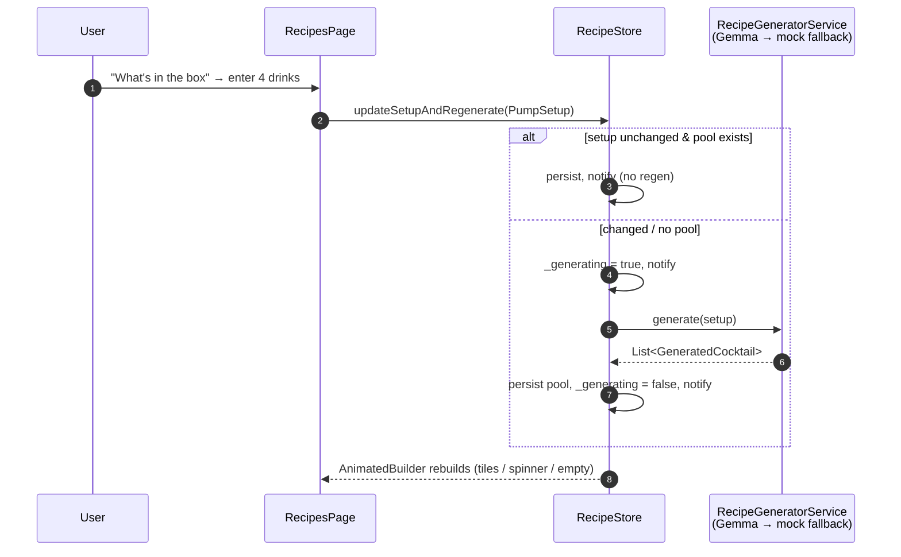
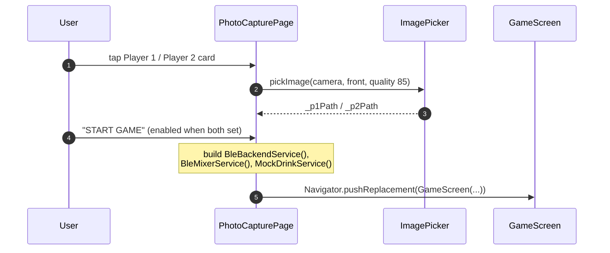
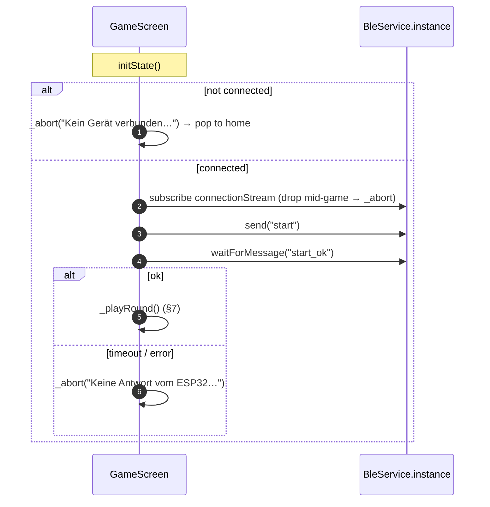
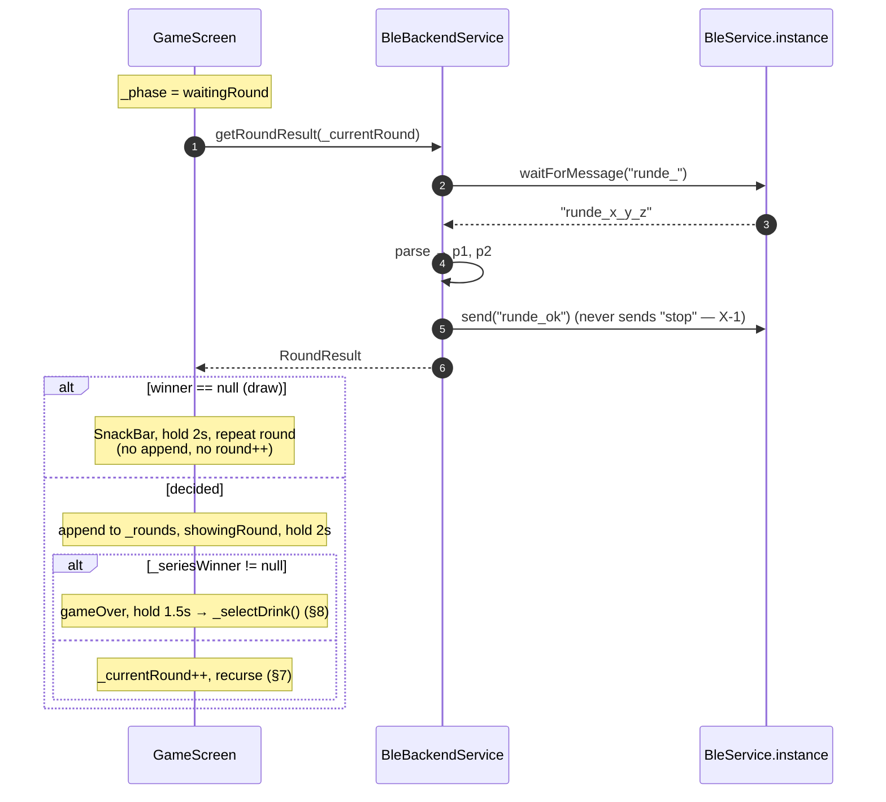
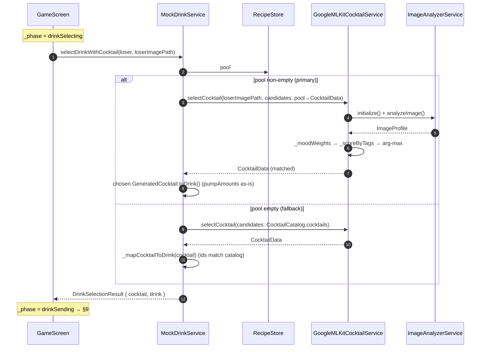
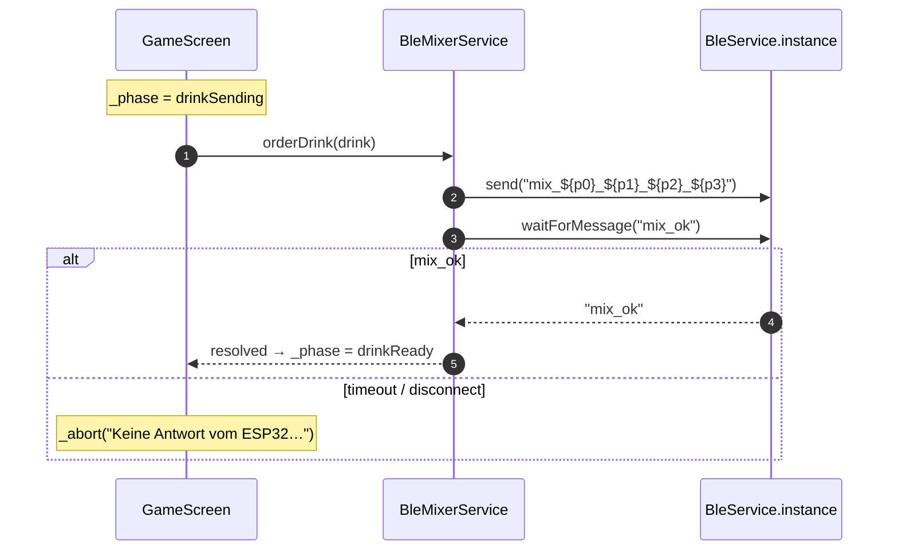

# Frontend — Sequence Diagrams

Internal flows of the Flutter app. Wire-level handshakes (BLE frames against the ESP32) belong in [`../cross-dependencies/sequence-diagrams.md`](../cross-dependencies/sequence-diagrams.md); this page only shows what happens **inside** the app, including recipe generation and the ML pipeline.

All paths are relative to [`code/frontend/lib/`](../../code/frontend/lib/). For the `GamePhase` state machine that complements §6–§9 see [features.md](features.md).

## 1 — App startup + model wiring

Only `main.dart` wires the on-device model; tests and test mode keep the mock generator and never trigger a model load. `RecipeStore.load()` restores the persisted pump setup and cocktail pool before the first frame.

## 2 — BLE scan & connect

Errors during `connect` bubble to a `SnackBar`. If already connected, `connect` first awaits `disconnect()`.

## 3 — Test mode

## 4 — Recipe generation (What's in the box)

`GemmaRecipeGeneratorService` lazily loads the on-device model and, on any failure (or <3 usable cocktails), falls back to `MockRecipeGeneratorService`. Model download/load progress is surfaced via `GemmaModelStatus` while `_GeneratingView` is shown. Incomplete setups clear the pool.

## 5 — Photo capture

## 6 — Game init (with abort guards)

## 7 — Play one round (with draws)

Any BLE failure inside `getRoundResult` triggers `_abort`. `_seriesWinner` is best-of-three (first to 2, or majority after 3). Wire `parts[1]` is ignored.

## 8 — Select drink (pool + ML pipeline)

No-face or errors inside `GoogleMLKitCocktailService` degrade to a random candidate. A single-candidate pool is returned without analysis.

## 9 — Order drink (BLE mix)

The full wire-level chain that follows `send("mix_…")` (BLE → ESP → UART → Nano → pumps → buzzer → ack chain) is in [`../cross-dependencies/sequence-diagrams.md`](../cross-dependencies/sequence-diagrams.md) §3. The home-screen MIX RANDOM DRINK button runs §9 directly against a random pool cocktail (using `MockMixerService` in test mode).
