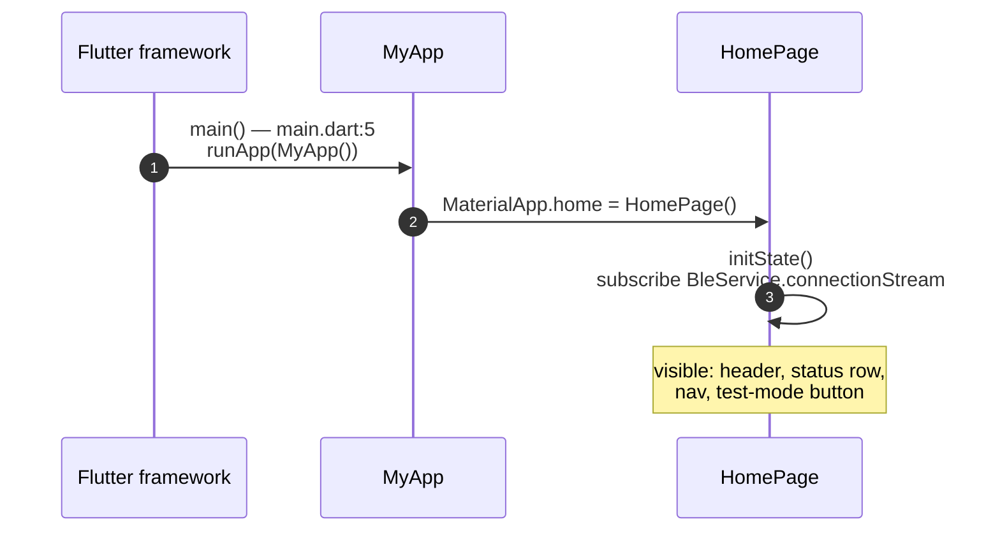
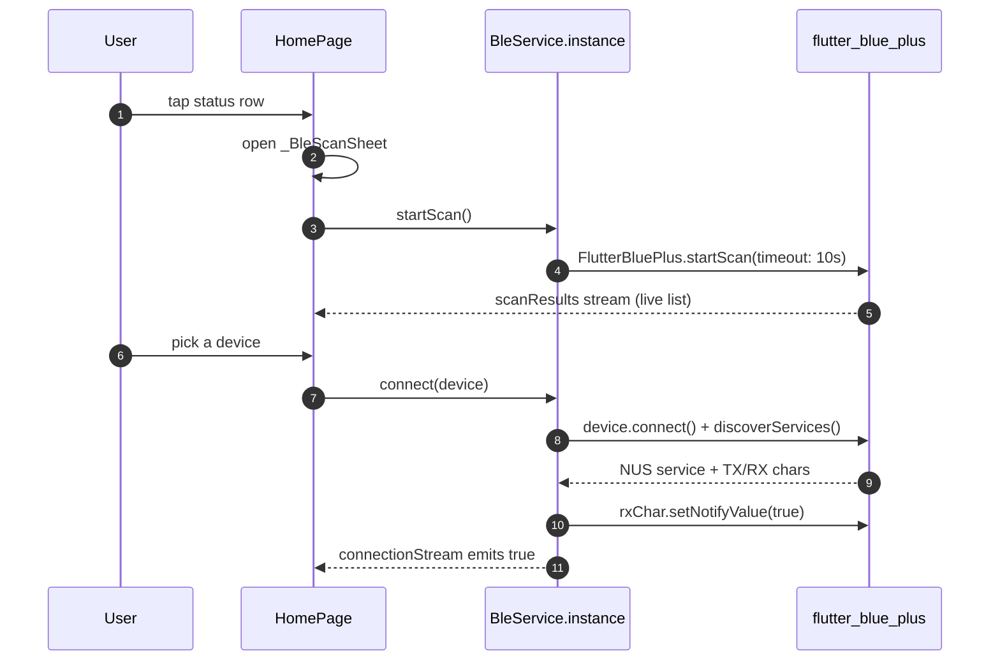
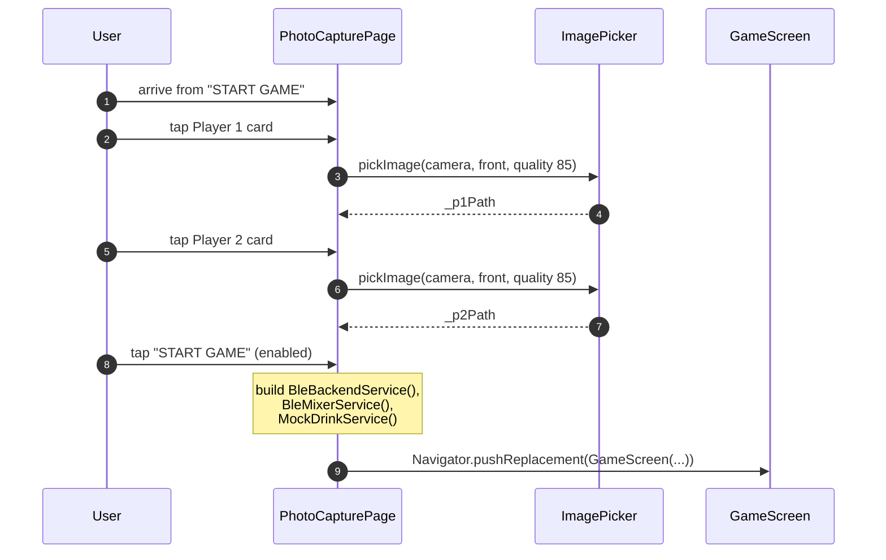
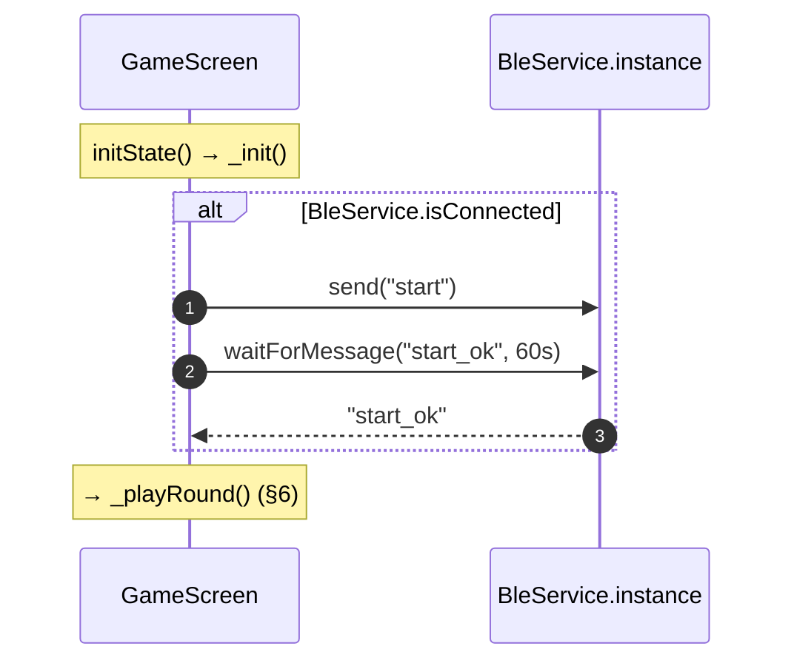
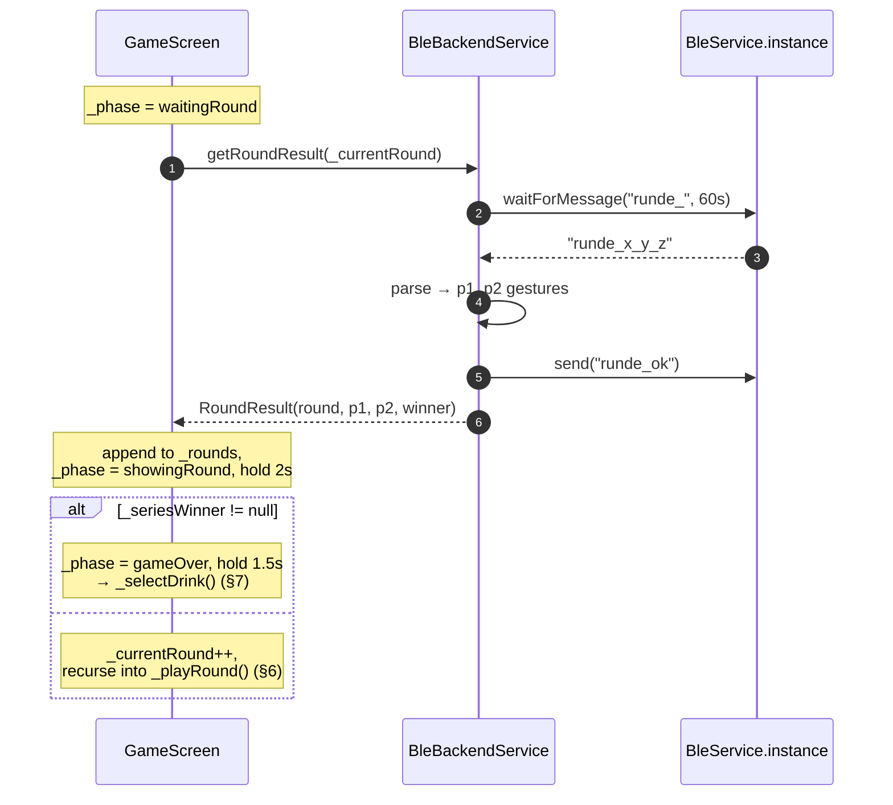
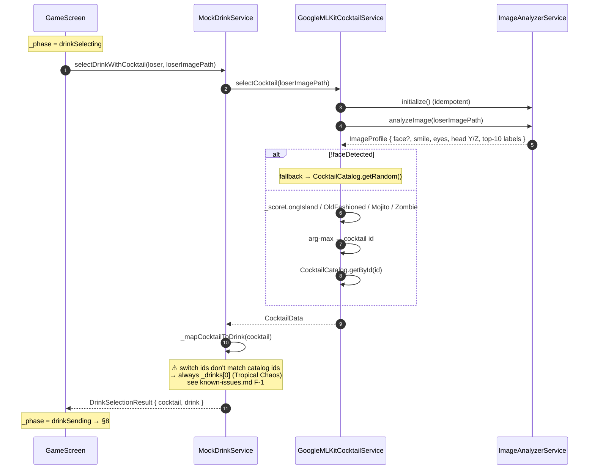
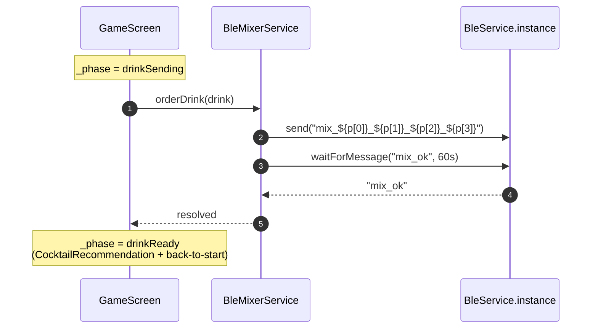

# Frontend — Sequence Diagrams

Internal flows of the Flutter app. Wire-level handshakes (BLE frames against the ESP32) belong in [`../cross-dependencies/sequence-diagrams.md`](../cross-dependencies/sequence-diagrams.md); this page only shows what happens **inside** the app, including the ML pipeline.

All paths are relative to [`code/frontend/lib/`](../../code/frontend/lib/). For the `GamePhase` state machine that complements §5–§8 see [features.md](features.md).

## 1 — App startup



The connection-stream subscription drives the BLE status badge throughout the session. `dispose()` cancels it.

## 2 — BLE scan & connect



Errors during `connect` bubble to a `SnackBar`. If `_connected` is already true, `connect` first awaits `disconnect()` to release the prior link.

## 3 — Test mode

```mermaid
sequenceDiagram
    autonumber
    participant U as User
    participant Home as HomePage
    participant Ble as BleService.instance
    U->>Home: tap "Test Modus (ohne ESP32)"
    Home->>Ble: enableTestMode()
    Ble->>Ble: _testMode = true, _connected = true
    Ble-->>Home: connectionStream emits true
    Note over Home: same UI as real connection;<br/>`send()` re-routes to sentMessages,<br/>`inject()` simulates inbound
```

From now on the debug panel inside the game (§6/§8 plumbing) plays the role of the ESP — see [features.md](features.md) "End-to-end test-mode walkthrough".

## 4 — Photo capture



`MockDrinkService` is the production ML-backed implementation despite the name — see [known-issues.md F-2](known-issues.md#f-2-mockdrinkservice-is-misnamed).

## 5 — Game init



If the BLE link is not connected (no real device and test mode disabled), `_init` skips both the `send` and the `waitForMessage` and goes straight to `_playRound` — but the round itself will then block at the BLE wait in §6 with no way forward.

## 6 — Play one round



`_seriesWinner` is best-of-three: first player to 2 wins, or the majority after 3 rounds. Draws inside the series do not short-circuit. Round count from the wire (`parts[1]`) is ignored — the app tracks it itself.

## 7 — Select drink (ML pipeline)



The default-branch bug in `_mapCocktailToDrink` ([known-issues.md F-1](known-issues.md#f-1-cocktail-id--drink-id-drift-makes-ml-pipeline-ineffective)) is the highest-priority correctness issue in the frontend — until it is fixed, the four `_score*` heuristics influence only the *displayed* cocktail name and description, not the pump amounts.

## 8 — Order drink (BLE mix)



The full wire-level chain that follows the `send("mix_…")` call (BLE → ESP → UART → Nano → pumps → buzzer → ack chain) is documented in [`../cross-dependencies/sequence-diagrams.md`](../cross-dependencies/sequence-diagrams.md) §3.
