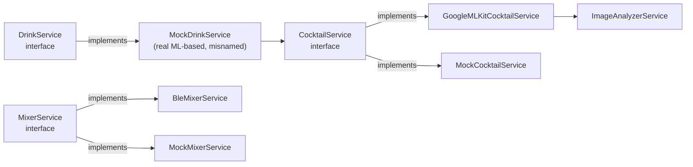

# Frontend — Service layer

All paths in this page are relative to [`code/frontend/`](../../code/frontend/).

The service layer sits between the UI and the platform plugins. Each service is either an **interface** (abstract class) with one or more concrete implementations, or a singleton wrapping a long-lived resource (BLE, ML Kit detectors). UI screens accept services via constructor injection so tests and the hardware-free "test mode" can swap them out.

## Models the services exchange

| Model | File | Purpose |
|---|---|---|
| `Gesture` (enum) | [`lib/models/gesture.dart`](../../code/frontend/lib/models/gesture.dart) | `rock`, `paper`, `scissors`. Extension `GestureExt` exposes `emoji`, `label`, and `versus(Gesture other) → int?` (1 if `this` wins, 2 if `other` wins, `null` for a draw). |
| `RoundResult` | [`lib/models/round_result.dart`](../../code/frontend/lib/models/round_result.dart) | `{round, p1, p2, winner}`. `winner` is computed in the constructor via `p1.versus(p2)`. |
| `Drink` | [`lib/models/drink.dart`](../../code/frontend/lib/models/drink.dart) | `{id, name, ingredients, pumpAmounts: List<int>}` (ml per pump, indices 0–3). |
| `CocktailData` | [`lib/models/cocktail.dart`](../../code/frontend/lib/models/cocktail.dart) | UI-side cocktail recommendation: `{id, name, description, pairingTags, recommendationReason}`. Distinct from `Drink` — see [ml-pipeline.md](ml-pipeline.md) for the mapping. |

## `BleService` — singleton

[`lib/services/ble_service.dart`](../../code/frontend/lib/services/ble_service.dart)

```dart
BleService.instance  // private constructor `BleService._()`
```

Wraps `flutter_blue_plus`. Owns the active `BluetoothDevice`, the TX `BluetoothCharacteristic`, and three broadcast `StreamController`s.

**NUS UUIDs (constants at top of file):**

| Char | UUID | Direction |
|---|---|---|
| Service | `6E400001-B5A3-F393-E0A9-E50E24DCCA9E` | — |
| TX (app → ESP) | `6E400002-…` | write |
| RX (ESP → app) | `6E400003-…` | notify |

> **Naming caveat:** these labels follow the Dart source, which names them from the **app's** viewpoint (`_txUuid` = the char the app transmits on = `6E400002`; `_rxUuid` = the char the app receives on = `6E400003`). The standard-NUS / firmware docs ([protocol.md](../cross-dependencies/protocol.md), [`../esp32-c3/protocol.md`](../esp32-c3/protocol.md)) label the same two UUIDs from the **peripheral's** viewpoint — so there `6E400002` is the "RX characteristic" (the ESP receives on it) and `6E400003` is the "TX characteristic". Only the labels flip; the data directions (`6E400002` carries app→ESP, `6E400003` carries ESP→app) are identical in every doc.

**API:**

| Member | Purpose |
|---|---|
| `Stream<String> messageStream` | Every line received on RX, UTF-8 decoded and trimmed. |
| `Stream<bool> connectionStream` | Connection state changes. |
| `Stream<String> sentMessages` | Only emits in test mode — surfaces every `send()` argument so the debug panel can show outgoing traffic. |
| `Stream<List<ScanResult>> scanResults`, `Stream<bool> isScanning` | Re-exported from `flutter_blue_plus`. |
| `Future<void> startScan() / stopScan()` | 10 s scan window. |
| `Future<void> connect(BluetoothDevice)` | Disconnects any existing device first, discovers services, locks onto the NUS TX/RX characteristics, subscribes to notifications. |
| `Future<void> disconnect()` | Symmetric to `connect`; also disarms test mode. |
| `Future<void> send(String msg)` | Appends `\n` and writes to the TX characteristic. In test mode, pushes to `sentMessages` instead. Throws `StateError('BLE not connected')` if the link is down outside test mode. |
| `Future<String> waitForMessage(String prefix, {Duration timeout = 60 s})` | Resolves with the first message starting with `prefix`. Throws `TimeoutException` after the timeout. |
| `void enableTestMode() / disableTestMode()` | Toggles a fake connection — `connectionStream` flips to `true`, `send()` reroutes. |
| `void inject(String msg)` | Pushes `msg` into `messageStream` (test mode only). |
| `bool isConnected, isTestMode` and `String? deviceName` | Inspection. |

The class is the only place the NUS UUIDs are mentioned in app code — change them and the entire chain rebreaks.

## `BleBackendService` — round receiver

[`lib/services/ble_backend_service.dart`](../../code/frontend/lib/services/ble_backend_service.dart)

Instantiable, injectable. Default uses `BleService.instance`.

```dart
Future<RoundResult> getRoundResult(int round) async {
  final msg = await _ble.waitForMessage('runde_');
  final parts = msg.split('_');                       // ["runde", "x", "y", "z"]
  final p1 = _parse(int.parse(parts[2]));
  final p2 = _parse(int.parse(parts[3]));
  await _ble.send('runde_ok');
  return RoundResult(round: round, p1: p1, p2: p2);
}
```

The `round` arg is the *caller's* counter — the value from the wire (`parts[1]`) is ignored. `_parse(int)` maps `0→rock`, `1→paper`, anything else→`scissors`. A malformed payload (`runde_x_y_z` where `y` is not an int) bubbles up as a `FormatException`.

## `BleMixerService` — mix sender

[`lib/services/ble_mixer_service.dart`](../../code/frontend/lib/services/ble_mixer_service.dart) implements [`MixerService`](../../code/frontend/lib/services/mixer_service.dart).

```dart
Future<void> orderDrink(Drink drink) async {
  final p = drink.pumpAmounts;
  await _ble.send('mix_${p[0]}_${p[1]}_${p[2]}_${p[3]}');
  await _ble.waitForMessage('mix_ok');
}
```

Assumes `pumpAmounts` has length 4. The `mix_ok` wait inherits `waitForMessage`'s 60-second timeout.

## Drink / cocktail / mixer abstractions



### `DrinkService` interface

[`lib/services/drink_service.dart`](../../code/frontend/lib/services/drink_service.dart)

```dart
abstract class DrinkService {
  Future<Drink> selectDrink({required int loserPlayer, required String loserImagePath});
  Future<DrinkSelectionResult> selectDrinkWithCocktail({required int loserPlayer, required String loserImagePath});
}
```

`DrinkSelectionResult = {CocktailData cocktail, Drink drink}` bundles the ML recommendation and the physical recipe.

### `MockDrinkService` — actually the ML implementation

Same file. Despite the name, this is the production implementation: it delegates `selectDrinkWithCocktail` to its injected `CocktailService` (default `GoogleMLKitCocktailService`) and maps the cocktail id to a hard-coded `Drink` via `_mapCocktailToDrink`. Renaming is tracked in [known-issues.md](known-issues.md).

Built-in drinks (`pumpAmounts` order = pump 0, 1, 2, 3 in ml):

| `id` | Name | Amounts |
|---|---|---|
| `tropical_chaos` | Tropical Chaos | `[30, 20, 10, 40]` |
| `sour_loser` | Sour Loser | `[20, 30, 20, 30]` |
| `blue_regret` | Blue Regret | `[10, 40, 30, 20]` |
| `bitter_defeat` | Bitter Defeat | `[40, 10, 10, 40]` |

`selectDrink` (the simpler API) ignores the loser image and picks `_drinks[DateTime.now().second % 4]` after a 2-second delay — used for the fast-path that doesn't show the AI recommendation card.

### `MixerService` interface and mocks

[`lib/services/mixer_service.dart`](../../code/frontend/lib/services/mixer_service.dart). One abstract method `orderDrink(Drink)`. `MockMixerService` waits 2 seconds and `print()`s. The file also contains commented-out `HttpMixerService` / `MqttMixerService` sketches — neither is wired in.

### `CocktailService` interface and impls

[`lib/services/cocktail_service.dart`](../../code/frontend/lib/services/cocktail_service.dart) — `Future<CocktailData> selectCocktail({required String loserImagePath})`.

- `GoogleMLKitCocktailService` ([`lib/services/google_ml_kit_cocktail_service.dart`](../../code/frontend/lib/services/google_ml_kit_cocktail_service.dart)) — the real ML scorer. See [ml-pipeline.md](ml-pipeline.md).
- `MockCocktailService` ([`lib/services/mock_cocktail_service.dart`](../../code/frontend/lib/services/mock_cocktail_service.dart)) — 500 ms delay, returns `CocktailCatalog.getRandom()`. The `useMLKit` flag has no effect today.

### `ImageAnalyzerService`

[`lib/services/image_analyzer_service.dart`](../../code/frontend/lib/services/image_analyzer_service.dart). Wraps `FaceDetector` (accurate mode, landmarks + classification) and `ImageLabeler`. `initialize()` is idempotent, `analyzeImage(path)` returns an `ImageProfile`, `dispose()` closes both detectors. Used exclusively by `GoogleMLKitCocktailService`. Field reference and emotion derivation live in [ml-pipeline.md](ml-pipeline.md).

## Cocktail catalog

[`lib/data/cocktail_catalog.dart`](../../code/frontend/lib/data/cocktail_catalog.dart) holds four `const CocktailData` entries (`long_island`, `old_fashioned`, `mojito`, `zombie`). `getById(String) → CocktailData?` and `getRandom() → CocktailData` (deterministic by clock second).

The four catalog ids match the four `_drinks` ids in `MockDrinkService` — `_mapCocktailToDrink` relies on this 1:1 mapping. If you add a cocktail, also add a `Drink` row and a switch arm or the new cocktail will silently fall back to `tropical_chaos`.

## Dependency-injection pattern

Two recurring shapes:

- **Singleton with optional override**: `BleBackendService([BleService? ble]) : _ble = ble ?? BleService.instance;`
- **Constructor injection with default factory**: `MockDrinkService({CocktailService? cocktailService}) : _cocktailService = cocktailService ?? GoogleMLKitCocktailService();`

Neither relies on a service locator; tests construct the graph by hand and pass it to the widget under test.
