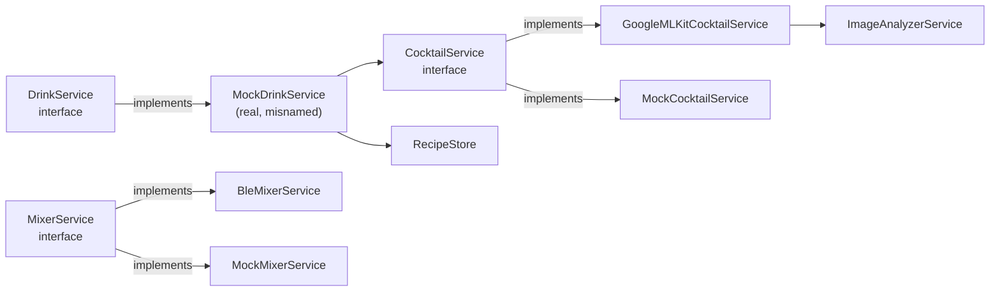

# Frontend — Service layer

All paths in this page are relative to [`code/frontend/`](../../code/frontend/).

The service layer sits between the UI and the platform plugins. Each service is either an **interface** (abstract class) with one or more concrete implementations, or a singleton wrapping a long-lived resource (BLE, ML Kit detectors, the recipe store). UI screens accept services via constructor injection so tests and the hardware-free "test mode" can swap them out.

## Models the services exchange

| Model | File | Purpose |
|---|---|---|
| `Gesture` (enum) | [`models/gesture.dart`](../../code/frontend/lib/models/gesture.dart) | `rock`, `paper`, `scissors`. Extension `GestureExt` exposes `emoji`, `label`, and `versus(Gesture other) → int?` (1 if `this` wins, 2 if `other` wins, `null` for a draw). |
| `RoundResult` | [`models/round_result.dart`](../../code/frontend/lib/models/round_result.dart) | `{round, p1, p2, winner}`. `winner` is computed in the constructor via `p1.versus(p2)`. |
| `Drink` | [`models/drink.dart`](../../code/frontend/lib/models/drink.dart) | `{id, name, ingredients, pumpAmounts: List<int>}` — the value sent verbatim as `mix_a_b_c_d`. `toJson()` emits only `{id, name}`. |
| `CocktailData` | [`models/cocktail.dart`](../../code/frontend/lib/models/cocktail.dart) | UI-side cocktail recommendation: `{id, name, description, pairingTags, recommendationReason}`. Used by the selfie matcher. |
| `GeneratedCocktail` | [`models/generated_cocktail.dart`](../../code/frontend/lib/models/generated_cocktail.dart) | A cocktail produced from the current `PumpSetup`: `{id, name, description, tags, pumpAmounts, refinementTip}`. Converts to `CocktailData` (`toCocktailData()`) and `Drink` (`toDrink()`), and JSON round-trips for persistence. `pumpAmounts` is passed to the wire unchanged. |
| `PumpSetup` | [`models/pump_setup.dart`](../../code/frontend/lib/models/pump_setup.dart) | Which drink sits at each of the four pumps (`List<String>` length 4). `isComplete`, `sameAs`, JSON round-trip. |
| `kMoodTags` | [`models/mood_tags.dart`](../../code/frontend/lib/models/mood_tags.dart) | Canonical mood-tag vocabulary (21 tags) shared by the recipe generators and the selfie matcher. Tags outside this list score 0 in matching. |

## `BleService` — singleton

[`services/ble_service.dart`](../../code/frontend/lib/services/ble_service.dart)

```dart
BleService.instance  // private constructor `BleService._()`
```

Wraps `flutter_blue_plus` (v2). Owns the active `BluetoothDevice`, the TX `BluetoothCharacteristic`, three broadcast `StreamController`s, and a small **message backlog**.

**NUS UUIDs (constants at top of file):**

| Const | UUID | Direction |
|---|---|---|
| `_svcUuid` | `6E400001-…` | Service |
| `_txUuid` | `6E400002-…` | app → ESP (write) |
| `_rxUuid` | `6E400003-…` | ESP → app (notify) |

> **Naming caveat:** the labels follow the **app's** viewpoint (`_txUuid` = the char the app writes on). Standard-NUS / firmware docs label the same UUIDs from the peripheral's viewpoint, so there `6E400002` is the ESP's "RX char". Only the labels flip; the data directions are identical.

**API:**

| Member | Purpose |
|---|---|
| `Stream<String> messageStream` | Every line received on RX, UTF-8 decoded and trimmed. |
| `Stream<bool> connectionStream` | Connection state changes. |
| `Stream<String> sentMessages` | Only emits in test mode — surfaces every `send()` argument for the debug panel. |
| `Stream<List<ScanResult>> scanResults`, `Stream<bool> isScanning` | Re-exported from `flutter_blue_plus`. |
| `Future<void> startScan() / stopScan()` | 10 s scan window. |
| `Future<void> connect(BluetoothDevice)` | Disconnects any existing device, connects (`License.nonprofit`), discovers services, locks onto NUS TX/RX, subscribes to notifications, and tracks `connectionState` so a dropped link flips `connectionStream`. |
| `Future<void> disconnect()` | Symmetric; also disarms test mode. |
| `Future<void> send(String msg)` | Appends `\n` and writes to TX (`withoutResponse: false`). In test mode, pushes to `sentMessages`. Throws `StateError('BLE not connected')` if the link is down outside test mode. |
| `Future<String> waitForMessage(String prefix, {Duration timeout = 60 s})` | Resolves with the first message starting with `prefix`, checking the backlog first. Throws `TimeoutException` after the timeout. |
| `void enableTestMode() / disableTestMode()` | Toggles a fake connection — `connectionStream` flips, `send()` reroutes. |
| `void inject(String msg)` | Feeds `msg` into the backlog + `messageStream` (test mode). |
| `bool isConnected, isTestMode` and `String? deviceName` | Inspection. |

**Message backlog (new):** `messageStream` is a broadcast stream, which drops events fired while nobody is listening (e.g. during the 2 s "showing round" delay between two `waitForMessage` calls). `BleService` keeps the last `_backlogLimit = 20` messages in `_backlog`; `waitForMessage` checks the backlog first, so a message that arrived early is still found instead of hanging forever.

## `BleBackendService` — round receiver

[`services/ble_backend_service.dart`](../../code/frontend/lib/services/ble_backend_service.dart) — instantiable, injectable, default `BleService.instance`.

```dart
Future<RoundResult> getRoundResult(int round) async {
  final msg = await _ble.waitForMessage('runde_');   // "runde_x_y_z"
  final parts = msg.split('_');
  final p1 = _parse(int.parse(parts[2]));
  final p2 = _parse(int.parse(parts[3]));
  await _ble.send('runde_ok');
  return RoundResult(round: round, p1: p1, p2: p2);
}
```

The `round` arg is the *caller's* counter — the wire value (`parts[1]`) is ignored. `_parse(int)` maps `0→rock`, `1→paper`, anything else→`scissors`. It always sends `runde_ok` and **never sends `stop`** — the source of cross-issue X-1 (see [`../cross-dependencies/known-issues.md`](../cross-dependencies/known-issues.md)).

## `BleMixerService` — mix sender

[`services/ble_mixer_service.dart`](../../code/frontend/lib/services/ble_mixer_service.dart) implements [`MixerService`](../../code/frontend/lib/services/mixer_service.dart).

```dart
Future<void> orderDrink(Drink drink) async {
  final p = drink.pumpAmounts;
  await _ble.send('mix_${p[0]}_${p[1]}_${p[2]}_${p[3]}');
  await _ble.waitForMessage('mix_ok');
}
```

Assumes `pumpAmounts` has length 4. The `mix_ok` wait inherits the 60 s timeout; a `mix_err` from the Nano is *not* relayed by the ESP, so a malformed order surfaces only via that timeout (then the game's abort logic).

## Drink / cocktail / mixer abstractions



### `DrinkService` interface

[`services/drink_service.dart`](../../code/frontend/lib/services/drink_service.dart)

```dart
abstract class DrinkService {
  Future<Drink> selectDrink({required int loserPlayer, required String loserImagePath});
  Future<DrinkSelectionResult> selectDrinkWithCocktail({required int loserPlayer, required String loserImagePath});
}
```

`DrinkSelectionResult = {CocktailData cocktail, Drink drink}` bundles the recommendation and the physical recipe.

### `MockDrinkService` — actually the production implementation

Same file, still misnamed (see [known-issues.md F-2](known-issues.md)). It takes an injected `CocktailService` (default `GoogleMLKitCocktailService`) and a `RecipeStore` (default `RecipeStore.instance`). `selectDrinkWithCocktail`:

1. **If `RecipeStore.pool` is non-empty** — the primary path — it matches the loser's selfie against the generated pool (`selectCocktail(candidates: pool.map(toCocktailData))`) and returns the chosen `GeneratedCocktail`'s own `cocktail` + `drink`. The generated `pumpAmounts` *are* the recipe; there is no id-based mapping.
2. **Otherwise (fallback)** — it matches against the built-in [`CocktailCatalog.cocktails`](../../code/frontend/lib/data/cocktail_catalog.dart) and maps the catalog id to a calibration `Drink` via `_mapCocktailToDrink`.

`selectDrink` simply unwraps `selectDrinkWithCocktail().drink`.

**Fallback calibration drinks** (`_mapCocktailToDrink`, `pumpAmounts` order = pump 0..3):

| Catalog id → | `_drinks` entry | Amounts |
|---|---|---|
| `long_island` | `tropical_chaos` | `[30, 20, 10, 40]` |
| `old_fashioned` | `sour_loser` | `[20, 30, 20, 30]` |
| `mojito` | `blue_regret` | `[10, 40, 30, 20]` |
| `zombie` | `bitter_defeat` | `[40, 10, 10, 40]` |

The switch arms now match the catalog ids (unlike the earlier drift — ex-F-1), so the fallback pours the right calibration drink for each catalog cocktail.

### `MixerService` interface and mocks

[`services/mixer_service.dart`](../../code/frontend/lib/services/mixer_service.dart). One abstract method `orderDrink(Drink)`. `MockMixerService` waits 2 s and `print()`s — used in test mode by the home-screen MIX RANDOM DRINK button (which has no debug panel to inject `mix_ok`). The file also carries commented-out `HttpMixerService` / `MqttMixerService` sketches — neither is wired in.

### `CocktailService` interface and impls

[`services/cocktail_service.dart`](../../code/frontend/lib/services/cocktail_service.dart):

```dart
Future<CocktailData> selectCocktail({
  required String loserImagePath,
  required List<CocktailData> candidates,   // the pool to choose from
});
```

The interface now takes a **candidate pool** rather than choosing from a fixed catalog — so it works against any dynamically generated cocktail set.

- `GoogleMLKitCocktailService` ([`google_ml_kit_cocktail_service.dart`](../../code/frontend/lib/services/google_ml_kit_cocktail_service.dart)) — the real matcher. Returns the single candidate immediately if `candidates.length == 1`; otherwise analyzes the selfie into per-tag mood weights and picks the highest-scoring candidate. Falls back to a random candidate on no-face or error. See [ml-pipeline.md](ml-pipeline.md).
- `MockCocktailService` ([`mock_cocktail_service.dart`](../../code/frontend/lib/services/mock_cocktail_service.dart)) — 500 ms delay, returns a random candidate; throws `StateError` if the pool is empty.

### `ImageAnalyzerService`

[`image_analyzer_service.dart`](../../code/frontend/lib/services/image_analyzer_service.dart). Wraps `FaceDetector` (accurate, landmarks + classification) and `ImageLabeler`. `initialize()` is idempotent, `analyzeImage(path)` returns an `ImageProfile`, `dispose()` closes both detectors. Used by `GoogleMLKitCocktailService`. Details in [ml-pipeline.md](ml-pipeline.md).

## Recipe-generation subsystem

The four drinks in the pumps are user-defined; the app generates cocktails that can be mixed from exactly those four ingredients.

### `PumpSetup` + `RecipeStore`

[`recipe_store.dart`](../../code/frontend/lib/services/recipe_store.dart) — a `ChangeNotifier` singleton (`RecipeStore.instance`, plus `RecipeStore.forTesting`). Single source of truth for:

- `PumpSetup setup` — the four ingredient names.
- `List<GeneratedCocktail> pool` — cocktails generated for that setup.
- `bool isGenerating`, `bool hasPool`.
- `ValueListenable<GemmaModelStatus>? modelStatus` — model download/load progress, non-null only when a model-backed generator is wired in.

Both are persisted via `shared_preferences` (`load()` on startup, `_persist()` after every change). Key methods: `updateSetupAndRegenerate(newSetup)` (regenerates only if the ingredients actually changed or no pool exists), `regenerate()`, and `useGenerator(generator, {modelStatus})` (swaps the generator at startup — the mock stays the default everywhere else). An incomplete setup clears the pool.

### `RecipeGeneratorService`

[`recipe_generator_service.dart`](../../code/frontend/lib/services/recipe_generator_service.dart) — `Future<List<GeneratedCocktail>> generate(PumpSetup)`.

- `MockRecipeGeneratorService` — deterministic (seeded by the ingredient names): the same setup always yields the same 3–6 cocktails. Assigns amounts to 2–4 pumps within bounds (`_minPerPump = 20`, `_maxPerPump = 80`, `_maxTotal = 250`), names each after its "hero" (largest-amount) ingredient. No AI or hardware needed — the default everywhere except the real app.
- `GemmaRecipeGeneratorService` ([`gemma_recipe_generator_service.dart`](../../code/frontend/lib/services/gemma_recipe_generator_service.dart)) — on-device LLM via `flutter_gemma`. Lazily initializes the model (from a bundled asset or a network URL), runs a chat with a German system instruction, parses the JSON, and **falls back to the mock** on any failure (unsupported platform, download error, parse error, or fewer than 3 usable cocktails). Wired only in `main.dart`.

### Gemma parsing helpers

[`gemma_recipe_parsing.dart`](../../code/frontend/lib/services/gemma_recipe_parsing.dart) — model-free (no `flutter_gemma` import), so it's unit-tested without a model:

- `kRecipeSystemInstruction`, `buildRecipePrompt(setup)` — the prompt contract (German, JSON-only, tags restricted to `kMoodTags`, `pumpAmounts` bounds).
- `parseGemmaCocktails(rawText, setup)` — extracts the first JSON array/object from arbitrary model output (tolerates prose and ```json fences), then sanitizes. Throws `FormatException` when no JSON is present.
- `sanitizeCocktails(items, setup)` — forces model output back into the same contract the mock enforces: clamps each amount to `[0, 80]`, ensures ≥2 pumps are used, scales totals down to ≤250, drops tags outside `kMoodTags` (default `classic`), guarantees the name mentions an ingredient, caps the pool at 6.
- `GemmaModelStatus` / `GemmaModelPhase` — model lifecycle surfaced to the UI (idle / downloading% / loading / ready / unavailable).

## Cocktail catalog (fallback only)

[`data/cocktail_catalog.dart`](../../code/frontend/lib/data/cocktail_catalog.dart) holds four `const CocktailData` entries (`long_island`, `old_fashioned`, `mojito`, `zombie`) with `pairingTags` drawn from `kMoodTags`. `getById(String)` and `getRandom()`. Used by `MockDrinkService` only when no pool has been generated; the ids are the ones `_mapCocktailToDrink` switches on.

## Dependency-injection pattern

Two recurring shapes:

- **Singleton with optional override**: `BleBackendService([BleService? ble]) : _ble = ble ?? BleService.instance;`
- **Constructor injection with default factory**: `MockDrinkService({CocktailService? cocktailService, RecipeStore? recipeStore})` defaults to `GoogleMLKitCocktailService()` + `RecipeStore.instance`.

Neither relies on a service locator; tests construct the graph by hand (`RecipeStore.forTesting`, fake analyzers, counting generators) and pass it in.
